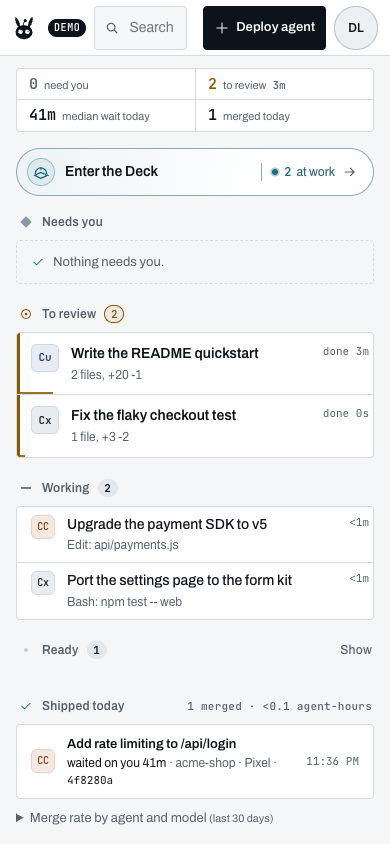
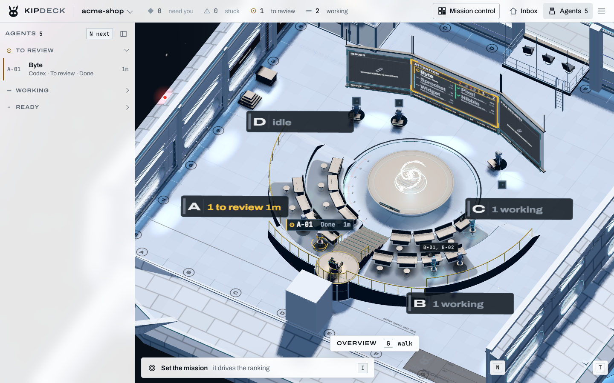

<picture>
  <source media="(prefers-color-scheme: dark)" srcset="design/logo/lockup-dark.svg">
  
</picture>

# Kipdeck

The inbox for your AI coding agents. Full control and clarity over every AI coding agent you run, in one place. See who is waiting on you and for how long, then answer, review and merge without leaving it.

```bash
npx kipdeck
```

> Not on npm yet: the name waits on a trademark search ([business/naming.md](business/naming.md)). Until it is published, [run it from source](#from-source).


No agents yet? `npx kipdeck --demo` plays five scripted ones on a throwaway repository, no CLI, sign-in or model needed ([the demo](docs/demo.md)).

Run it inside the repository you work in. It opens in your browser, signed in, with that repository as your first project. Claude Code, Codex and Cursor run side by side (OpenCode, Pi, Grok, Muse and DeepSeek Harness in beta), each on a branch of its own, and you answer, review and merge from one page, on your laptop or your phone. It runs on your machine or your team's dev box, and nothing leaves it.

[**Run it**](#run-it) · [**Try the demo**](docs/demo.md) · [**Attach an agent**](#attach-an-agent-you-already-started) · [**Teams and servers**](docs/self-hosting.md) · [**Labs**](#labs) · [**Docs**](docs/features.md)

- **One loop.** **Deploy agent**, get pinged when it needs you, answer its question in one box, review the diff beside the list and Merge, and it lands in **Shipped today**. The oldest agent waiting on you opens by itself; the top bar says how many need you and how many are ready to review, with the oldest wait ticking, the median wait today and what merged today. Merge waits a few seconds for Undo and names where it goes. See [the inbox](docs/inbox.md).
- **One ranking, one set of names.** `src/shared/attention.ts` decides the order and names the five states everywhere: Needs you, Stuck, To review, Working and Ready. The inbox's sections (Needs you with the stuck ones in it, To review, Working, Ready), Mission control, the tab title and notifications all read from it ([the inbox](docs/inbox.md) has the full list).
- **A record of what shipped.** Every merge and send-back is kept on your machine as a signed record: which agent and model, the prompt, and who reviewed it. **Numbers** shows human wait time and the merge rate per agent and model from it.
- **The Deck.** **Enter the Deck** in the top bar (or **D**) takes you to `/deck`: the same agents at their stations on a 3D starship bridge, a wall display for a team room. It and the rest beyond the inbox (goals and the timeline, meetings, voice, Proof of Merge on testnets) are [Labs](#labs), all on as Kipdeck ships; an admin switches off what a team doesn't want.

| | |
| --- | --- |
|  |  |
| The same inbox on a phone. | The Deck at `/deck`: the same agents as a room, for a team's wall screen. The old `/bridge` address still lands there. |

## Run it

You need **Node.js 20+**, **git** and one agent CLI: **Claude Code** (`npm install -g @anthropic-ai/claude-code`), **Codex** (`npm install -g @openai/codex`) or **Cursor** (`cursor-agent`), signed in. The **GitHub CLI** (`gh`) is optional: with it, agents open pull requests and the inbox shows their checks; without it, review reads the local diff and Merge merges on your computer.

In the repository you work in:

```bash
npx kipdeck
```

1. It starts on `http://localhost:4600` (or the next free port) and opens your browser, **already signed in**. On your own computer there is no password to type: the link it opens works once, and `npx kipdeck open` makes a new one if you lose the tab. Only your computer can reach it.
2. The repository you started it in is your first project. Started somewhere else, the setup card offers to clone one from GitHub.
3. The **setup card** says which agents it found and whether each is signed in, the project, and GitHub, with the one line to run for anything that isn't ready.
4. **Deploy your first agent** starts one on a safe task (a 5-line SUMMARY.md on how to run the repository). It shows up under **Working** within seconds and under **To review** when it's done.

Nothing asks you anything in the terminal, and there are no settings to fill in. From a clean machine to the first agent at work takes under two minutes, most of it npm downloading; `design/time-to-first-agent.mjs` times it (from a local `npm pack` tarball until the package is on npm).

### From source

Until `kipdeck` is on npm, build it once, link it, and run it from inside the repository you work in:

```bash
git clone https://github.com/zbagdzevicius/kipdeck
cd kipdeck && npm install && npm run build && npm link     # npm link puts kipdeck on your PATH
cd ~/code/your-project && kipdeck                           # what npx kipdeck will run
kipdeck --demo                                              # the demo, anywhere
```

The demo's pill copies that same `kipdeck` command.

Common options:

```bash
npx kipdeck --port 4700                 # this port or nothing
npx kipdeck ~/code/my-project           # keep the office's data in that project, as agent-office did
npx kipdeck --host 0.0.0.0              # let your network in (then everyone else signs in with a password)
npx kipdeck --password 'correct horse'  # a password, even on this computer
npx kipdeck --no-open                   # print the sign-in link instead of opening a browser
npx kipdeck --telemetry                 # share anonymous usage numbers (off by default)
```

To have a `kipdeck` command instead: `npm install -g kipdeck`, or [`install.sh`](install.sh) (macOS and Linux) and [`install.ps1`](install.ps1) (Windows), which install the same package. Every option is in [docs/configuration.md](docs/configuration.md); choosing models and providers per agent is in [docs/agents.md](docs/agents.md).

## Attach an agent you already started

Started Claude Code or Codex in a terminal before Kipdeck was running? Quit it there (Ctrl+C or `/exit`), then in the same folder:

```bash
npx kipdeck attach
```

It finds that folder's newest Claude Code or Codex session in the CLI's own files, and the running Kipdeck carries it on as one of its agents: the same conversation, now in the inbox with its terminal, its questions, its changes and the merge. `--list` shows the folder's sessions, `--session <id>` picks one, and Cursor needs `--agent cursor --session <id>` (`cursor-agent ls` lists them).

## Labs

Labs are the parts beyond the inbox. Each is on as the office ships, so a first visit sees all of it, the Deck first. An admin switches any of them off for everyone from **Open Labs...** at the foot of Settings > Account on the home page (or Labs in Ctrl+K) or the Deck's menu, and the choice is kept in the office's `labs.json`; `--labs bridge,ops` (or `AGENT_OFFICE_LABS`) holds some on from the command line so nobody can switch them off, and `--labs -proof` (or `--labs none`) holds them off. Turning one off hides it; nothing is deleted. A lab being on never asks the browser for anything by itself: the microphone and screen sharing wait for your click, sound for your first click or key, and Proof of Merge stays on testnets and sends nothing anywhere until an admin sets up its keys and flags.

| Lab | What it brings (switching it off hides it) |
| --- | --- |
| GitHub boards and queue | Issues, Pull requests, the Task queue and Mission control in the home page's avatar menu and Ctrl+K. |
| Deck (3D) | **Enter the Deck** in the home page's top bar (and **D**, and Go to Deck in Ctrl+K), and the deck plan in the pane while no agent is selected. `/deck` itself always opens. |
| Goals and timeline | Goals and milestones, the Timeline and Crew tabs in Mission control, the Deck's mission strip and the Services board. |
| Meetings | The Review bay and the planning whiteboard. |
| Voice | Voice chat, screen sharing and the dictation mic in prompt boxes and terminals. |
| Deck ambience | The Deck in full: mascot, ship's voice, hands, celebrations, start of watch, ship motion and the ambience bed (from your first click or key). Off, the Deck starts calm. |
| Proof of Merge (testnets) | Bounties and payouts, attestations, ERC-8004 reputation, x402 paid tasks and `/pom/`. Their HTTP routes don't exist and their socket messages go nowhere while it's off. Any chain flag (`--x402`, `--attest`, `--reputation`) holds it on. |

More in [docs/labs.md](docs/labs.md).

## What it does

- **The inbox.** Every agent in four sections (Needs you, To review, Working, Ready), one button per row, the selected agent's live terminal, diff and log beside the list, and Shipped today under it ([the inbox](docs/inbox.md)). It draws after about 175 kB on any laptop or phone; the old `/lite` address goes there.
- **Deploy, attach, answer, review, merge.** The Deploy sheet starts an agent on a branch of its own; `kipdeck attach` adopts one started in a terminal; Answer, Review changes, Fix checks and Merge do what they say, with or without GitHub. With a GitHub repository and no pull request yet, Open PR comes first. On a team, each row says whose agent it is, and **Mine / Team** filters the inbox.
- **Numbers.** Human wait time, changes merged, the merge rate and agent-hours, the last 7 days against the 7 days before, and the merge rate per agent and model with its N, from the signed shipped log on your machine ([metrics](docs/metrics.md)).
- **Settings in three panes.** Account, Agents and Notifications. Seven keys, and Help on **?** ([controls](docs/controls.md)).
- **Teams.** Accounts with invite links, a shared dev box reached by SSH tunnel or Tailscale, and the team's Slack or Discord channel ([below](#teams-and-servers)).
- **Agents that manage agents.** Every agent can list, deploy, message and stop the others through the `kipdeck` MCP server or the `office-workers` command ([agents](docs/agents.md)).
- **Mission control** (with the GitHub boards and queue lab on): the same ranking with reminders, the review inbox and the digest of what happened while you were away ([mission control](docs/mission-control.md)).

Everything else, the 3D Deck with its crew, moments and ambience, goals and the timeline, meetings, voice and Proof of Merge on testnets, is in [Labs](#labs) (all on unless an admin switches them off) and described in [features](docs/features.md).

## Teams and servers

The same inbox runs on a server for a team: everyone reaches it through an SSH tunnel or Tailscale, with their own account. One script each for [AWS](docs/self-hosting.md#deploy-to-aws-ec2), [Azure](docs/self-hosting.md#deploy-to-azure), [Railway](docs/self-hosting.md#deploy-to-railway), [Fly.io](docs/self-hosting.md#deploy-to-flyio), [Dokploy](docs/self-hosting.md#deploy-to-dokploy) and [any Ubuntu or Debian machine](docs/self-hosting.md#deploy-to-any-ubuntu-or-debian-server), all in [docs/self-hosting.md](docs/self-hosting.md). Off your own computer the office asks for a password or an account, never a sign-in link.

## Add users

Everyone gets their own account, so their name is on their operator, in chat and on every terminal they type into.

**1. On a server, let them in first.** On a [Tailscale](docs/aws.md#tailscale) office, everyone on your tailnet can already open it. For someone who isn't, share the machine with them from Tailscale's Machines page: **Invite teammates** (Ctrl+K) says how. Skip to step 2.

Otherwise the office is only reachable through an SSH tunnel, so a teammate needs their SSH key on the machine. In the office, open **Invite teammates** (Ctrl+K) and type their GitHub username. On AWS, Railway, Fly.io or Dokploy you can also do it from your terminal:

```bash
deploy/aws.sh invite octocat        # installs the keys from github.com/octocat.keys
deploy/aws.sh allow 203.0.113.7     # their IP ("allow anywhere" opens SSH to every IP)
deploy/railway.sh invite octocat    # on Railway, SSH answers every IP already
deploy/fly.sh invite octocat        # and on Fly.io
deploy/dokploy.sh invite octocat    # and on Dokploy
```

It prints the command to send them. They leave it running and open http://localhost:4600:

```
ssh -L 4600:localhost:4600 office@<your-office-ip>
```

(On Railway and Fly.io the address carries a port of its own, like `ssh://office@zephyr.proxy.rlwy.net:17738`. On Dokploy it's the server's SSH port for the office: `ssh://office@203.0.113.7:2222`.)

Their key logs in as a locked-down `office` user that can only forward to the office port: no shell, no other ports. Running the office on your own computer, or on your own domain over HTTPS? Skip this step.

A teammate with Kipdeck on their computer can run `npx kipdeck tunnel office@<your-office-ip>` instead of the `ssh` line: it opens the same tunnel, and every web server a worker starts opens on their computer too ([docs/tunnel.md](docs/tunnel.md)).

**2. Make them an account.** Open **Accounts** (Ctrl+K) and make an invite link. Name it (or let them pick) and make them a *Member* or an *Admin*. The link works once, for 7 days, and they choose their own password. Make one for yourself too, as an admin.

The same works from a terminal on the office's machine, even while it runs:

```bash
kipdeck accounts                      # accounts and open invites
kipdeck accounts invite ada --admin   # prints a single-use /join#... link
kipdeck accounts role ada member
kipdeck accounts revoke ada           # signed out within seconds
```

On the EC2 machine, run it through `deploy/aws.sh ssh` (on Azure, `deploy/azure.sh ssh`):

```bash
deploy/aws.sh ssh 'node /opt/agent-office/bin/agent-office.js accounts invite ada --dir "$(cat /etc/agent-office/home)"'
deploy/railway.sh ssh 'node /opt/agent-office/bin/agent-office.js accounts invite ada'   # on Railway
deploy/fly.sh ssh 'node /opt/agent-office/bin/agent-office.js accounts invite ada'       # on Fly.io
deploy/dokploy.sh ssh 'node /opt/agent-office/bin/agent-office.js accounts invite ada'   # on Dokploy
```

**Their own Claude and GitHub.** With accounts, everyone's workers run on their own Claude plan, and the office acts on GitHub as them: comments, merges, labels, pushes and pull requests show up under their name. The first time someone comes in, **Your sign-ins** opens (it's under Menu > Deck too). *Sign in with Claude* gives them Claude's sign-in page and takes back the code it shows. *Sign in with GitHub* shows a one-time code for github.com/login/device. They can paste a token from `claude setup-token`, or a GitHub token, instead. A shell they open at a console runs as them, so `claude auth login` and `gh auth login` typed there work too. Admins can use the office machine's own sign-ins instead. Each account's sign-ins live in `.agent-office/homes/<account>/`, and revoking the account deletes them. The boards are read with the machine's own `gh`, so that account needs read access to the repos. Running it just for yourself, with no accounts, none of this applies.

**3. Turn off the shared password.** Until you do, anyone who knows the office password can get in, as an admin. Once everyone has an account, switch it off in **Accounts** (signed in with your own admin account), or `kipdeck accounts password off`.

**Removing someone.** Revoke their account in **Accounts** (or `kipdeck accounts revoke <name>`), and on a server also remove them in **Invite teammates** (on AWS, `deploy/aws.sh uninvite <name>`; on Railway, `deploy/railway.sh uninvite <name>`; on Fly.io, `deploy/fly.sh uninvite <name>`; on Dokploy, `deploy/dokploy.sh uninvite <name>`) to take away their SSH keys and drop open tunnels (other teammates just reconnect). If the shared password is still on, change it with `deploy/aws.sh reset-password` (or `deploy/railway.sh reset-password`, `deploy/fly.sh reset-password` or `deploy/dokploy.sh reset-password`).

## Controls

Seven keys on the home page: **Ctrl+K** (find an agent or a command), **N** (deploy an agent), **Enter** (answer or review the selected agent; it never merges), **Esc** (back to the list, or close a window), **/** (search), **?** (Help) and **D** (enter the Deck). Up and Down move the selection. Everything else is a row's button or the avatar menu: Numbers, Settings, Help and Sign out (Labs is in Settings and Ctrl+K). The Deck's keys (walking, the Overview, voice) are in [docs/controls.md](docs/controls.md#the-deck-labs).

## Development

```bash
npm install
npm run dev          # Vite with hot reload on :5173, the server on :4600 (password: dev)
npm run typecheck
npm test
```

The browser tests (`tests/*-e2e.test.ts`) load the built bundle, so run `npm run build` before `npm test` to include them. They skip, saying why, when there is no bundle or it is older than the sources it was built from (after an edit, a merge or a checkout).

Server edits restart the server, not the workers. After changing `ptyhost.ts`, bump `PTY_PROTOCOL` in `ptys.ts` so the next server replaces the PTY host.

[docs/code-layout.md](docs/code-layout.md) says where the code lives, and where a new feature's pieces go.

The rules for coding agents working on this repository are in [`AGENTS.md`](AGENTS.md), which Codex, OpenCode and most other agent CLIs read. `CLAUDE.md` only imports it for Claude Code, so new rules go in `AGENTS.md`.

The npm package ships the built `dist/` (`files` in `package.json`), so `npx kipdeck` builds nothing on the user's machine: run `npm run build` before `npm publish` (`prepare` does it on `npm pack` and `npm publish`). `install.sh` and `install.ps1` install that package.

## More

- [The inbox](docs/inbox.md): the home page, its loop, the setup card, Numbers, Settings, its keys and the shipped log
- [The demo](docs/demo.md): `npx kipdeck --demo` with five scripted agents, the hosted read-only demo, and the scripts that make the video, the GIF and the deck's screenshots
- [Metrics for the deck](docs/metrics.md): what each number means, where it comes from, and what not to show
- [The landing page](docs/landing.md): `site/landing/` (`npm run build:site`, then `npm run preview:site`), what each section's motion shows, the one file that holds the product's name, its speed budgets (`npm run perf:site`), accessibility and search tags, the design-partner ask, and how to deploy it to Cloudflare Pages ([site/landing/README.md](site/landing/README.md))
- [Features](docs/features.md): the inbox first, then the whole office in detail
- [Controls](docs/controls.md): the inbox's keys and menu, the Deck's keys, and a terminal's
- [Agents](docs/agents.md): every harness Kipdeck runs (Claude Code, Codex, Cursor; OpenCode, Grok, Muse, DeepSeek Harness and Pi in beta), models and effort, and the prompts
- [Configuration](docs/configuration.md): every command-line option, and where Kipdeck keeps its data
- [Teams and servers](docs/self-hosting.md): one script each for AWS, Azure, Railway, Fly.io and Dokploy, the one-line setup for any Ubuntu or Debian server, or by hand behind Caddy or nginx; references for [AWS](docs/aws.md), [Azure](docs/azure.md), [Railway](docs/railway.md), [Fly.io](docs/fly.md) and [Dokploy](docs/dokploy.md)
- [Workers' servers on your own computer](docs/tunnel.md): `kipdeck tunnel`, which opens every agent's web server on your computer by itself
- [Security](docs/security.md): the threat model, signing in on your own computer, and anonymous usage numbers
- [How it works](docs/how-it-works.md): the architecture, and security notes
- [Code layout](docs/code-layout.md): where the code lives, adding a feature or an agent provider, and the size guard
- [The launch kit](launch/kipdeck/README.md): the gates before launch, the posts and the design-partner outreach

Labs and the Deck:

- [Labs](docs/labs.md): what each lab brings back, and how to switch it
- [Mission control](docs/mission-control.md): the attention ranking, the floor's mission and milestones, linking work to goals, the review inbox, the timeline, reminders and the digest
- [Design system](docs/design.md): each surface on screen, the motion and the deck's sound, demo mode, and how to check a design change with `design/shoot.mjs`
- [The deck](docs/deck.md): what's where on the 3D deck, cell addresses, and the Overview camera
- Proof of Merge on testnets (a lab; nothing goes on chain until an admin sets up its keys and flags, and not part of the product's pitch): [bounties](docs/bounties.md), [attestations on Base Sepolia](docs/proof-of-merge.md), [ERC-8004 reputation](docs/reputation.md), [the public showcase](docs/showcase.md), [paid tasks over x402](docs/x402.md) and [the chain launch kit's tools](docs/launch.md) (archived)

## Upstream credit

Kipdeck is a fork of [agent-office](https://github.com/AgentSystemLabs/agent-office), created by webdevcody, Copyright (c) 2026 AgentSystemLabs, released under the MIT License. The server's architecture (projects as floors, agents and their terminals, worktrees, provider adapters, the queue, meetings, voice, accounts, the tunnel and the deploy scripts) is upstream's; [NOTICE](NOTICE) lists what this fork replaced and what remains, and [launch/chain/disclosure.md](launch/chain/disclosure.md) lists our changes commit by commit. This fork is not run by the upstream authors. The package is `kipdeck`; the `agent-office` command it also installs is the same command, so upstream's scripts keep working.

## License

[MIT](LICENSE)
