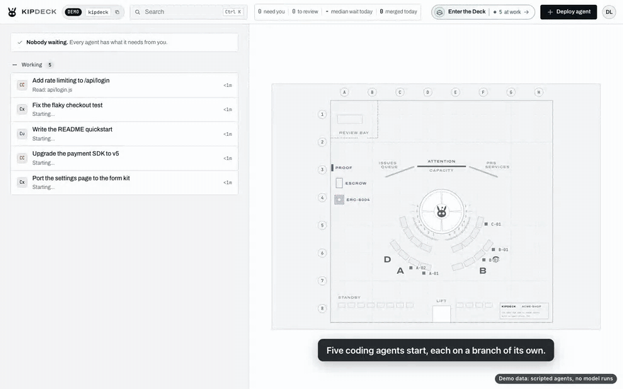

# The demo

Back to the [README](../README.md).

See the whole loop in a minute without an agent CLI, a sign-in or a model:

```bash
npx mergeline --demo
```



It opens the inbox in your browser, signed in, on a throwaway repository called `acme-shop`, and five agents start on it: two on Claude Code, two on Codex and one on Cursor. They are scripted stand-ins, so nothing runs a model and nothing costs anything, but the office reads them exactly as it reads the real CLIs: each reports over that agent's own hooks, works on a branch of its own in a worktree, and commits real files, so the diffs are real diffs and Merge really merges. A note over the inbox says it's the demo, with `npx mergeline` to copy for the real thing.

The repository lives in a fresh temporary folder, never in your code. Ctrl+C stops the agents and deletes the folder. The demo needs Node.js 20+ and git; on Windows, run it in WSL (the stand-ins are sh scripts). Anonymous usage numbers are always off in the demo.

## What happens

The script is the same every time (`src/server/demo/script.ts`):

| When | Agent | What you see |
| --- | --- | --- |
| 0:00 | all five | They arrive under **Working**, one by one, each with a line saying what it's doing (`Read: api/login.js`, `Bash: npm test`...). |
| about 0:20 | Codex, *Fix the flaky checkout test* | It ran the test, found `.total` drawn twice, and asks *Update the snapshot or fix the selector?* The row moves to **Needs you**. |
| about 0:35 | Claude Code, *Add rate limiting to /api/login* | Done: a rate limiter, its tests and the login route, three files. The row moves to **To review**. |
| about 0:50 | Cursor, *Write the README quickstart* | Done: the README and `docs/quickstart.md`. **To review**. |
| always | Claude Code, *Upgrade the payment SDK to v5*; Codex, *Port the settings page to the form kit* | They keep working, so the inbox never looks finished. |

Then it's yours:

1. **Answer.** Press **Answer** on Codex's row (or Enter): its terminal opens in the pane with the reply box ready. Type `fix the selector` and press Enter. The row goes back to Working, and a little later Codex's fix is in To review.
2. **Review.** **Review changes** on Claude Code's row opens the diff beside the list.
3. **Merge.** **Merge** merges its branch into `acme-shop`'s `main` on your computer, and it lands in **Shipped today** with the agent, the commit and how long it waited on you, signed in the shipped log.
4. **Send back** with a note works too: the stand-in commits the note and finishes again.
5. **Deploy agent** works with any task: the stand-in writes a short note about it in `notes/`, commits it, and finishes.

To see it on your phone, start it with `--host 0.0.0.0` and sign in from the phone with the password the terminal prints.

## The hosted demo

`mergeline --demo --read-only` is the demo for a public address: anyone who opens it is signed in to watch, with no password, and nothing they send changes anything.

- **Watching.** Visitors see the same inbox, the agents' live terminals, their diffs and Shipped today. Over the socket the office only takes the messages that look (a terminal's screen, a diff, the shipped log); over HTTP only GET and HEAD. Anything else (Deploy agent, typing into a terminal, Merge, Labs) is dropped, and a toast says *This demo is read only* with `npx mergeline --demo` to run it at home. The Get started checklist is hidden, since nobody watching can do its steps.
- **A scripted reviewer.** Since nobody watching can act, the office plays the reviewer, *Demo Lead (scripted)*: it answers Codex's question about ten seconds after it's asked, merges each finished change ten or twelve seconds after it's done, and 25 seconds after the last merge starts the round over from the repository's first commit with an empty shipped log. A round is about 80 seconds; one that gets stuck starts over after five minutes.
- **Deploying it.** [`deploy/demo/Dockerfile`](../deploy/demo/Dockerfile) is the image (Node, git and the build; no agent CLI, no volume), and [Fly.io's notes](fly.md#a-public-read-only-demo) deploy it with [`deploy/demo/fly.toml`](../deploy/demo/fly.toml). Any Docker host works: publish port 8080 and set `AGENT_OFFICE_ALLOWED_HOSTS` to the names it's reached at. What it exposes is in [Security](security.md#the-read-only-demo).

## Faster

`MERGELINE_DEMO_PACE=4 npx mergeline --demo` plays the script four times faster (up to 20): the question comes at about 0:05. The tests run it at six.

## The video, the GIF and the deck's screenshots

All three are made from the demo by scripts, so they can be made again after a change:

```bash
npm run build
node design/record-demo.mjs        # the 60-second video and the 30-second GIF (needs ffmpeg)
node design/shoot-demo.mjs stage-5/after   # screenshots, with the deck's four in shots/fundable/stage-5/deck/
```

- **`design/record-demo.mjs`** records the loop in a headless browser at 1440x900 and on a 390x844 phone, with captions on the page and a pointer where it clicks, cuts the waiting out with ffmpeg, and adds a title card, the terminal's real output for `npx mergeline --demo`, and an end card. It writes `mergeline-demo.mp4` and `mergeline-demo.gif` to `design/shots/fundable/stage-5/video/` (not in git) and copies the GIF to `docs/img/demo.gif` for the README. The end card says it was recorded with the demo's scripted agents.
- **`design/shoot-demo.mjs`** takes the screenshots: the agents arriving, the inbox with a question and a change to review, the answer, the diff, the merge, the same on a phone, the Bridge view as a wall display, and the hosted demo with its read-only note. The deck's four (home, the pane with the diff, the phone and the Bridge wall view) are copied to `deck/` without toasts.

The pitch video with real agents follows the same story on a real repository, recorded by hand: `npx mergeline` in the repository, three agents deployed from the sheet (Claude Code, Codex, Cursor), the question answered from its row, a diff reviewed and merged, one merged from a phone. If a step needs a retake, the demo is the fallback.

## For developers

The demo is `src/server/demo/`: `script.ts` (the repository's files, the fleet's steps and the reviewer's schedule, as data), `standin.ts` (the stand-in agent, written out as `standin.cjs` with an sh wrapper per command), `workspace.ts` (the repository and the stand-ins, first on the office's PATH), `index.ts` (`setUpDemo`, called by `cli.ts` before the office starts), `director.ts` (seats the fleet and, read only, plays the reviewer and the rounds; started with the office's clocks) and `readonly.ts` (what a visitor may send). The way in is `http/routes/demo.ts`, a route that only exists in the read-only demo. The page's note is `src/client/home/demo.ts`, from the welcome message's `demo`. Tests: `tests/demo.test.ts` (the script, the guard, the options and the hosted demo end to end) and `tests/demo-e2e.test.ts` (the demo in a browser).
