# Design system

Back to the [README](../README.md).

UGC Army looks and behaves the same on every surface: the 3D deck, the 2D view at `/lite`, the sign-in pages and the `/pom/` showcase. This page walks through it as it is on screen: what each surface shows, how things move and sound, demo mode, and how to check a change. The rules and tokens themselves (colors, type, the status table, voice) are the short contract in [DESIGN.md](../DESIGN.md); where the deck's places are is [The deck](deck.md).

## The idea in one paragraph

The deck is calm by default. Floors, consoles and units are slate and steel, and hue is zoned: Signal orange (hue 20 to 40) only when a unit needs a person, red when it is stuck, amber-yellow when its work waits for review, violet for proof on chain, ship-cyan for the instruments and quiet work, and the command's gold and brass (hue about 48, desaturated) on the dais and the chair. Every state also has its own shape (a solid diamond, a hollow triangle with a bar, a hollow circle with a dot), so the screen still reads in grayscale, for color-blind people and in compressed video. One ranking, `src/shared/attention.ts`, decides who needs someone, and everything that counts or orders units reads it: the top bar, the needs-you chip, the Attention board, the Units rail, the 2D plan, the favicon and the marks over the units. Counts are said in two places only: the top bar and the Attention board's header.

## The surfaces

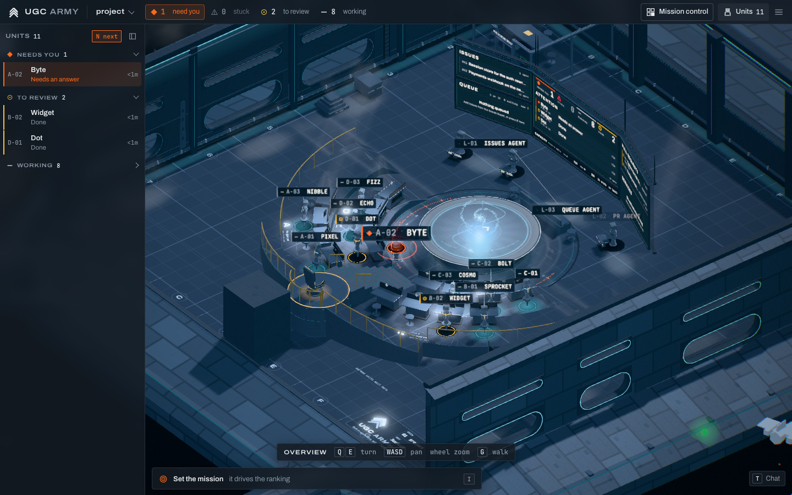

The Overview (G) is the demo shot: the whole deck from above with no perspective, raised over its starboard quarter so the amphitheatre reads in section. Units that need you stand on their pod's ready line with an orange diamond turning over them and a wave spreading across the floor from them; a stuck unit has a red triangle blinking over it, a red rim round its station and a hatched ring; a unit to review an amber ring turning at its feet; units at work wear ship-cyan (band, visor and a halo on the floor) and a small cyan pip over the head. From the Overview, the callouts of units that need you or are stuck are drawn half again as big. Callouts that would cover each other stack clear, the units that need someone placed first, with a hairline back to the unit when one is lifted, and a callout that would run off the side of the view or under the Units rail slides back in. Arrows at the edge of the screen point to units out of view that need you, are stuck or are to review, in that order; a crowded edge drops the ones to review first.

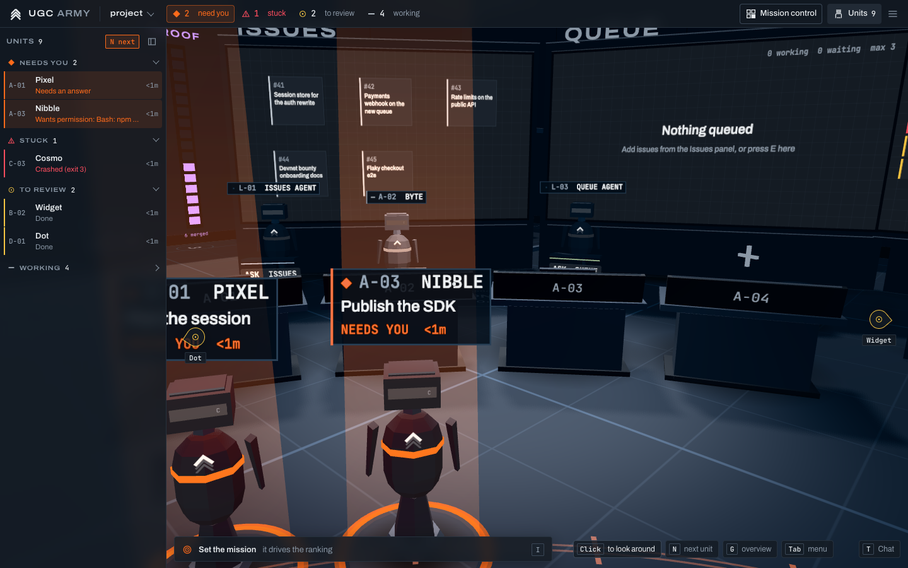

In Walk (first person, the default) callouts show more as you get closer: from across the deck the call sign and name, near a unit its task and how long it has been in its state.

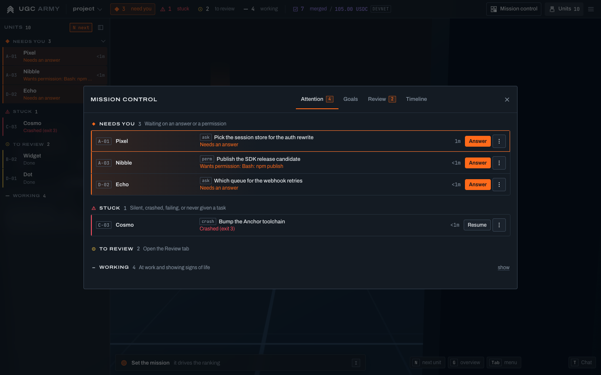

Mission control (I) lists units by the same ranking, each row with its call sign in a mono chip, why it is there in plain words and one primary verb. Units are never told apart by color: hue is for state.

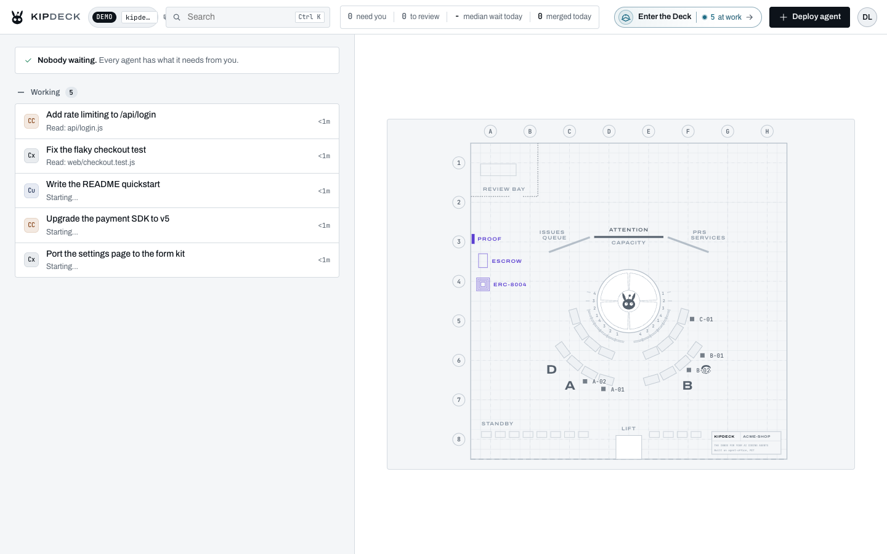

The 2D view at `/lite` draws the deck as a plan from the same layout file as the 3D deck, beside the ranked list. Below 720px wide the plan folds away and the list is the page.

Settings > Bridge > Bridge lights sets Night (low light, for watching in a dark room) or Day (high light, a cool mid-grey ship rather than a white room) for the 3D deck, or Auto to follow the system. The same setting paints the HUD (the dark set by night, the print set by day), the 2D view, whose contrast button flips it, and the sign-in pages, so every surface of the office agrees. Brightness steps the 3D deck's lights two steps either way. See [the deck](deck.md#light-and-materials).

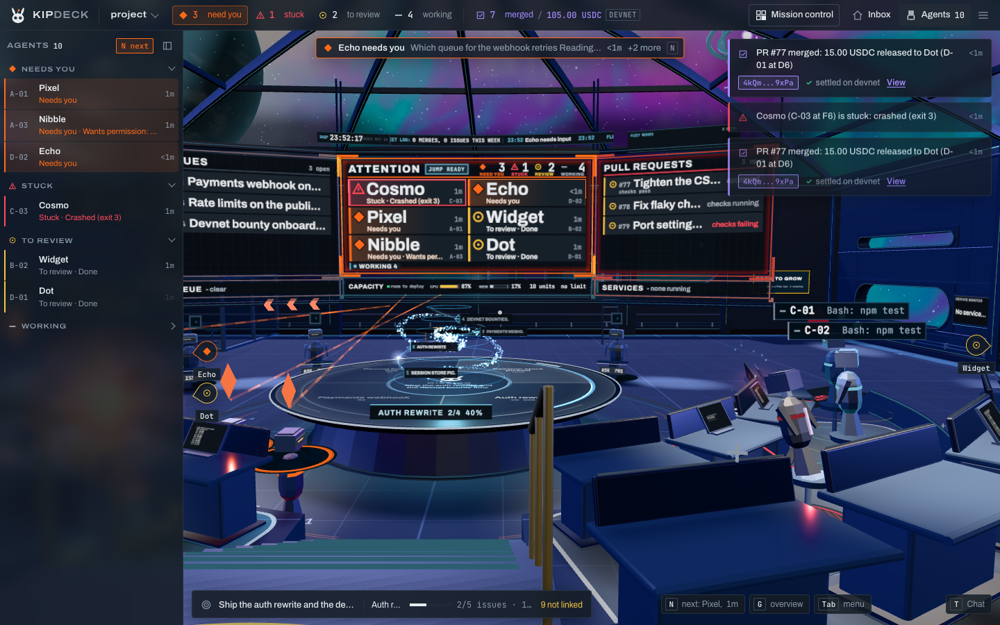

Toasts stack top right under the bar, all one card: a glyph column and a stripe in the state's color, one sentence that names the unit by its address (`Widget (B-02 at F2)`), and the time in mono from the deck's one clock. A unit that starts asking is not a toast: it comes in as a compact chip at the top of the view under the counters (its diamond, who and what for, N), which folds into the top bar's needs-you counter after a few seconds and never covers the deck's lower left (`features/needsyou/ui.ts`). A proof toast adds the transaction or attestation id in a violet chip, a green settled tick and a link to the testnet explorer, and stays up longer so there is time to click it.

### The bridge from the captain's chair

The deck is a command amphitheatre (`src/shared/amphitheater.ts`, `src/client/features/amphitheater/`): the chair stands on a dais 1.8 m up at the back, two tiers of consoles step down from it to a pit round the mission table, and the situation arc hangs over the far side of the pit. From the chair the frame reads in bands, top to bottom: space through the canopy over the arc, the arc, the pit and the holo, then the tiers with the crew. Nothing on the deck is drawn over a board's text, and the boards are sized for the chair.

- **The framing.** Sitting in the chair closes the field of view from 55 to 50 degrees and aims the view 30% of the way up the arc, from an eye about 3 m over the deck (`features/amphitheater`). At 1440x900 the arc takes about a quarter of the frame's height and two thirds of its width, with about 30% of bow over it; `tests/sightline.test.ts` holds it to a fifth, two fifths and a quarter.
- **Distance and type.** The arc's middle is 6.5 m north of the table, about 18 m from the captain's eye (it was 21 m), the Attention board 7.2 by 3.2 m and each wing's boards 4.6 by 1.8 m. The Attention board's names are 0.5 m type: from the chair their capitals stand 17 px tall at 1440x900. A wing's row is 0.3 m type, about 12 px. A wing board shows as many rows as its height takes (`rowsFor` in `features/boards/screen.ts`): two as built, four once the board under it folds.
- **The sightline.** Every console's hood, a person standing on either tier, the holo at its tallest and the board agents stay under the line from the seated eye to the arc's foot (`tests/sightline.test.ts`); `SHOOT_MASK=1` on the interior shot paints every board magenta and counts what covers them on screen.
- **The Attention board is the hero.** It is the brightest, most urgent thing on the arc (`features/tv/attention.ts`, `plan.ts`). Its header says ATTENTION, then the counts in the top bar's order (needs you, stuck, review, working: its glyph, its number, its word), and a ship-cyan JUMP READY chip while a jump waits for the captain; nothing else in the room counts. Under it the units are cards, in the order a captain acts on them: stuck, needs you, to review, working, done. Two columns of three full cards, each its state's stripe and glyph, the name in 0.5 m type, why it is there and its call sign under it, and how long at the right. A stuck card has a red rim; needs you and stuck cards a wash of their hue. A unit that is stuck, needs you or waits for review is never left off: past six the board steps down to two columns of five, then three of five, rather than hide one. Working units get cards only when they all fit; otherwise they fold into one *WORKING 12* chip along the foot, and so does done (a green check, its own glyph). Three cards or fewer go full width rather than fill one column beside empty glass: the first, when its unit needs the captain or is stuck, is the hero (a taller row, its hue's wash and rim, the N key that goes to it), and a row left over says how many of the crew are on task (in place of the *WORKING* chip). With nobody waiting and the crew at work the board says *ALL CLEAR* in the settled green. The text is `#E8ECEF` on a smoked ground at 88%, so space shows faintly through and a board is never a black rectangle, and under the bloom.
- **The wings fold.** An empty Queue or Services folds to a 0.34 m pill at the arc's foot (*QUEUE - clear*, *SERVICES - none running*), and Issues or Pull requests over it grows down into the room it gave up, its rows the same size, two more of them (`features/boards/fold.ts`, `wingHeights` in `shared/amphitheater.ts`). It eases over about half a second, at once with less motion.
- **Chrome in the colour of the most urgent state.** Round every board's face a 2 px lit bezel and four corner brackets (`features/arcchrome`, one instanced draw), in the colour of what that board most urgently shows: the Attention board orange while anyone needs you, red for stuck, amber for review; Pull requests red for failing checks, amber for one waiting on review; Queue orange while one of its units needs you; ship-cyan dim otherwise. The wings take their hue at a little over half strength, so the hero stays the brightest frame, and a run of light chases round the Attention board while someone needs you or is stuck. Each board's canvas glows faintly in the same hue inside its edges, and its title's rule takes it.
- **The pull toward a unit out of view.** While a unit that needs you or is stuck is out of view, the wing on its side brightens in its hue and three chevrons step outward along the arc's foot under it, beside the compass's mark at the edge of the screen.
- **The holo is a route column.** Over the table stand seven stacked scan rings narrowing as they rise, a band of brighter light climbing them every 3 s; the course winds up round the column with a node for each waypoint (solid once passed, ringed for the active one, hollow ahead) and its name on a dark plate beside it; the ship's chevron rides the course, and each unit working toward a waypoint is a small marker parked round its node, all of them one draw (`features/bridge/holo.ts`, `holo-route.ts`). The column's top stays under the chair's line to the capacity strip. One caption on a dark plate at the table's lip on the conn's side says where the ship is making for (*AUTH REWRITE  2/4  40%*, `features/life/heading.ts`); the ring of lettering that turned round the plot is gone. The holo's uplight hangs 1.5 m over the top, so the table no longer burns a white hot spot: the holo stays under the bloom, and the brightest marks in the room are the orange and red ones.
- **The holo keeps out of the way.** Every frame the four work boards', the Attention board's and the capacity strip's faces, with their chrome, are projected to the screen (`features/boardfaces`). The holo's star map and its cone fade to nothing inside those rectangles, over a soft edge of 4% of each one's size (`features/bridge/holo-mask.ts`), and ten times a second a waypoint's plate that would cover a board stands down (`holo-labels.ts`). The cone is also never taller than the line from the seated eye to the arc's foot, nor than 2.3 m over the deck.
- **Signals in the room.** Each state is its own shape, colour, motion and place (`features/signals`, one instanced draw a kind): needs you an orange diamond turning half a metre over the head (standing down while the unit's close-up card shows, as the stuck triangle does), with a beam of orange light from it to the arc's foot under its card on the Attention board, a pulse running up it; stuck a red triangle blinking once a second and a red rim on the floor round its station; to review an amber ring of three arcs turning slowly at the feet; working a small cyan pip over the head. The marks sit at their hue's full strength and no further, so the tone mapping never washes the diamond toward pink. The soft orange light column that stood over a unit that needed you is gone.
- **One label a unit.** A unit shows one label on screen, chosen in this order: its mark at the edge of the screen while it's out of view, else its card on the Attention board while that board is up and at least 110 px tall, else its callout in the room; you standing within 4 m of it keeps its callout (`features/workers/labels.ts`). The compass points from where a unit is (one that needs you on the ready line), not from its seat. Ten times a second, callouts of units at work or parked that pile on one another (each covering a quarter of another) fold into one chip that counts them (*5 working*), or names them when there are three or fewer (*A-03, D-02 working*), kept clear of the view's sides, the rail and the compass's marks. A unit that needs you, is stuck or waits for review never folds into a chip, and nor does the selected unit: its callout is placed first, outlined in cyan and drawn over its neighbours'. A callout that found no slot under a board stands down rather than sit on the board's face, and over a board the crosshair steps back to a small faint dot.
- **Callouts dock under the boards.** After the callouts are placed clear of each other, one whose chip would cover a board docks into a slot row under that board's lower bezel, as near its unit as there is room, still tied to it by its hairline (`features/workers/dock.ts`). The ones docked there already shuffle along to make room, and a second row opens under the first once it is full. Callouts that need you or are stuck come first in the order, so they dock first. Any other with no slot stands down (its mark and its card say it), so none is left on a board's face or half faded over another card. From the Overview the pods' ground labels are placed before any callout, so a callout lifts or shrinks clear of a label's words rather than sitting on them. The board agents' callouts at their lecterns take part too.
- **The focus lean.** From the conn (in the captain's chair, or standing on the dais in mouse-look), once the mouse has moved since you sat down, rest the crosshair on a board for 350 ms and the field of view eases to 38 degrees over 600 ms (ease in and out), so a row's names stand about 15 px tall. Any mouse move over 2 px, a key, or the crosshair leaving the board eases it back over 400 ms. With reduced motion or Ship motion Off it cuts instead. It sets the camera's field through one zoom helper (`core/zoom.ts`) that the jump's framing uses too, each adding its say to the base (`features/focuslean`).
- **No fog on attention.** The boards' faces and chrome, a unit's band, its ring and inlay, its glyph and callout chip, and the signals over and round it are `fog: false`, so no haze ever greys a state.

### Panels are tables

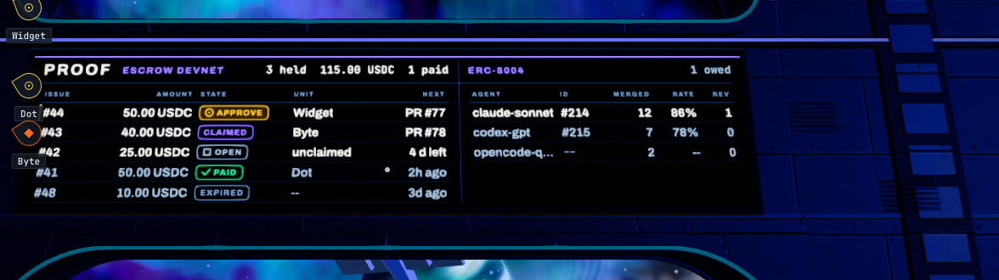

Every panel on the deck that carries data lays it out as a table, the same way (`src/client/features/boards/table.ts`, on the screens of `features/boards/screen.ts`): a header row of small capitals over a strong rule, rows of one height with a hairline between them and a faint band on every other one, words in Archivo at the left and data (counts, amounts, times, keys) in JetBrains Mono, right-aligned so the figures line up. A row's state is a chip, an outline in its hue with its glyph inside, so it reads without colour; a row that waits on someone gets a stripe of that state's hue down its left edge, and a finished or past one steps back to the lighter muted. A cell never runs off its column: it is cut with an ellipsis. Rows that don't fit are counted in "+N more" under the table. Each panel is drawn at its own canvas scale, so its body type is 8 to 11 cm high, readable from where you stand to use it, and it repaints only when what it says changes.

From across the deck a table's rows are a few pixels tall, so past 8 m each panel swaps its table for its far face (`features/boards/far.ts`): its name small at the top and three or four headline counts across it, each a glyph, a number at least 30 cm tall on the wall and a word, in the state's hue (the ledger: what's held in escrow, to approve, blocked, paid; the Review bay's board: to review, failing, the longest wait; its sign by the door, two counts on its narrower face: to review, then failing or the oldest wait; the service monitor: how many services run, its port in its name; the planning board: milestones done, late, tasks on it, queued; the docs rack: docs, the last edit, folders; the pit wall: reply and review today and the queue). Walking up, it turns back into its table under 6.5 m, so it never flickers at the line. The distance is checked a few times a second, never every frame, and a panel repaints only when it changes face.

| Panel | Where | Its tables |
| --- | --- | --- |
| Planning board | flush on the west wall, between the Review bay and the Proof corner | The mission's statement under the title; its milestones (state: done, now in ship-cyan, next; issues closed of all; units on it; spent; due, or how many days late); beside them the sketch everyone draws, or the task queue (on it, next, later) while nobody has drawn. |
| Review bay board | the bay's west wall | Free: the deck's review inbox, oldest first (who, the work, what to do next as Mission control's button says it, checks, waiting). In a review: its seats (part, unit, doing, turn, tokens) beside the outline of the file it writes, its state and spend along the foot. |
| Review bay sign | in the bay's front glass, the pane west of its door, 1.8 by 1 m | Laid out like the wall boards: its name and how many wait (or the pattern and its round) in the title bar, then a row each, oldest first: the unit's call sign (or the PR's or issue's number), what to review, its state as a chip (review in amber with the ringed dot, failing in red with the triangle, a payout in violet) and its age, with what to do next and its checks under it; four rows and +N more. In a review, its seats: the unit, its part, its turn and its tokens. Its far face is read from the captain's chair, 25 m off. |
| Service monitor | flush on the east wall, between the north-east port and the hull frame by the Services board | Up close, the live page of the service on it (see [The service monitor](deck.md#the-service-monitor)); behind it, a card on the board layout: the service's name and port, whose it is and its command, and its keys, or *No service running*, or an Open button where it can't be live. |
| Proof ledger | the west wall, over the port behind the vault | The bounties (issue, amount, state, unit, next), the ones waiting on an admin's approval and the blocked first, then the live, then the settled; in its header the network said as a testnet (*devnet test USDC*, or *mock chain*) and what's held and paid in all. Beside them the agents' ERC-8004 records by merges (agent, id, merged, merge rate, reverts) and what the office still owes the chain. |
| Docs index | over the docs rack | The project's Markdown, the latest changed first: title, folder, edited, size. It looks again every five minutes while the tab shows. |
| Pit wall | on the Review bay's roof | The two clocks (today, seven-day median, waits counted) beside today's reviews as bars. |

The chips keep each hue to its owner: amber for a payout to approve or a review, red only for a blocked bounty or failing checks, violet for the chain's own steps (claimed, paying, devnet), the settled green tick for paid or passing, and steel for open and waiting. No chip is ever orange.

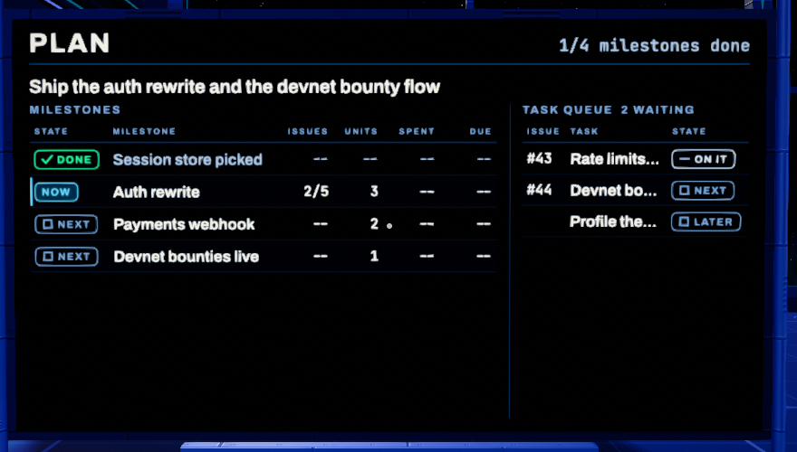

### Bounty tokens

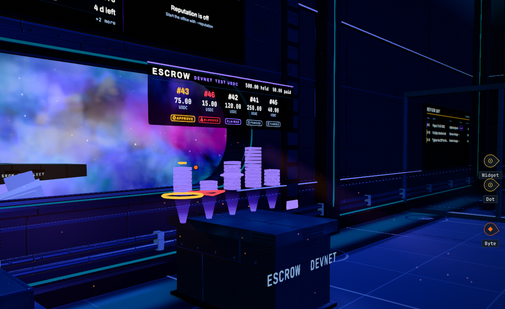

A bounty is a thing you can see in the room, not only a row (`src/client/features/bounties/`). Every token stands for a real bounty on the deck's issues, worked out from the floor's bounties (`logic.ts`, pinned by `tests/bounty-tokens.test.ts`): nothing is drawn while bounties are off, and no amount is ever made up. The token is a hexagonal coin of proof's violet light, bright at its rim and hollow in the middle, so it reads as a hologram and not a gold piece; every coin on the deck is one instanced mesh of the same coin.

- **The vault.** Over the escrow vault on the Proof corner, a stack of coins for each bounty still in escrow, standing in a narrow cone of light off the lid. A stack is as tall as its amount: one coin for the first 2 USDC, growing with the square root (50 USDC is 5 coins, 250 is 12, never more than 14). Over the stacks, a label with a column for each: the issue, the amount in mono and the state's chip, under a header that says ESCROW, *DEVNET TEST USDC* (or *MOCK CHAIN*) and what's held and paid in all. Six stacks fit; past that the last column counts the rest. A new funding drops its coins onto the stack, one after another.
- **The Issues board.** A funded issue's row carries its amount in violet mono at its right, and a coin hovers over a faint hex socket past it, out of the glass; the title bar says how many are funded, in test USDC.
- **A payout.** The merge beat's pulse climbs the rail and the lid lifts (below). The released bounty's stack waits on the vault, paying, until then; then its coins fly out of the vault in an arc over the deck to the console of the unit that earned them, turning over as they go, each as big as reads from where you are (about 20 px across from the captain's chair) with a short trail of fading coins behind it, all in one draw; and a receipt floats up over the console: the amount, the unit and its cell, the pull request and the devnet transaction (its head and tail) beside the settled tick. It holds eight seconds and fades. With nobody on the deck to fly to, the receipt stands over the vault.

| State | Its stack | Its chip |
| --- | --- | --- |
| Funded (open) | the bare stack | steel, the hollow square |
| Claimed | clamped by a violet hex ring: a unit has it | violet |
| Waiting on an admin's approval | in a hollow amber ring with a small one over it, the review glyph laid flat | amber, the review glyph |
| Blocked | in a hollow red triangle | red, the stuck glyph |
| Paying out | lifted off its cone of light | violet |
| Paid | gone from the vault: its coins flew to the unit | the settled tick, on the ledger |

Nothing idles: the coins move only when a bounty changes. With reduced motion or Ship motion Off nothing drops or flies: the stacks are as they are and the receipt is simply there over the console for its six seconds. The vault's meshes are culled with the corner when it is out of view: with four bounties held the conn draws four more calls (the Issues board's coins and what of the corner is in its view), 295 against 291 in the shots.

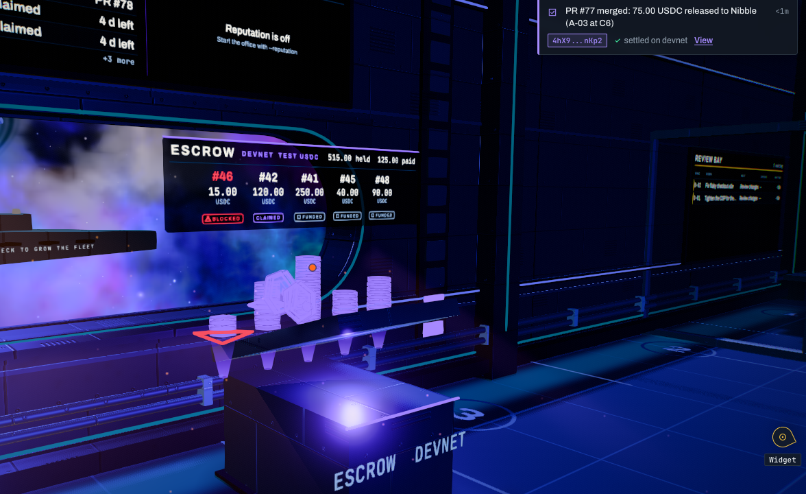

### Your hands in first person

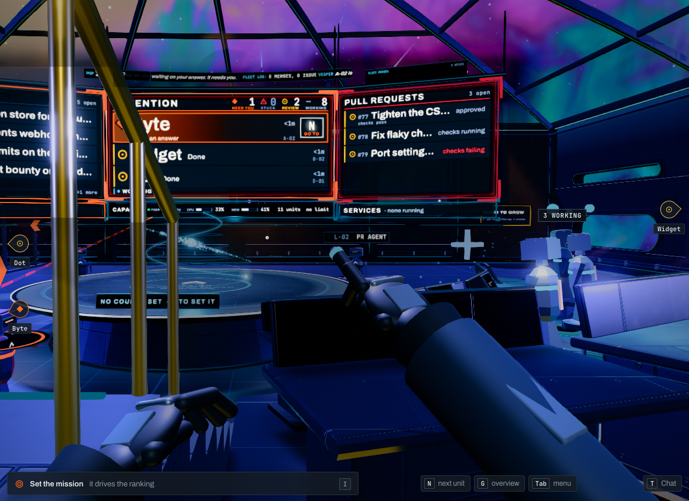

Walking the deck in first person you see your own gloved forearms at the bottom corners of the view, so you stand on the bridge rather than float over it (`src/client/features/hands/`, after upstream agent-office's first-person hands). They are a flight suit in the units' two tones, a lighter plate along each forearm, a gauntlet cuff with a brushed steel ring, a dark synthetic leather glove with a steel ridge over the knuckles, and fingers in a loose fist. They sit low, only the knuckles and cuffs in the bottom corners, the left a touch lower and further back than the right, so they never read as a mirror. Nothing on them takes a state's hue: the one instrument is the right index fingertip, a touch pad that lights ship-cyan as it presses, and a small ship-cyan clock on the left wrist.

- **What they do.** They lag a few centimetres behind a quick turn and catch up, breathe, swing opposite each other as you walk, and lift when you jump. Whenever you use something (E or a click: a board, a station, a seat, a button) the right hand reaches in toward the crosshair, the index finger straightens and taps, and comes back (0.42 s, the same reach your character makes for everyone else). While Mission control is open the left hand holds up a slim datapad low in the left of the view, with the top bar's four counts on its glass, each its glyph, a mono number and its word; it is painted on a change of the counts only.
- **Where they go.** Out of the way whenever they would be in it: in third person, sat down (the conn's framing, a bean bag's view), in the Overview and while the arrival or taking the conn has the camera. They slide down out of view and back up (a cut with less motion). Their frame is centred on the canvas right of the Units rail, as the seated view is.
- **How they are drawn.** In a small scene of their own, in the view's frame, drawn after the deck over a cleared depth buffer, so a console or a wall you walk into never cuts through them. Through the bloom composer they are a pass straight after the scene (`overlay` in `features/lights/bloom.ts`), so the glow, the grade and the edge smoothing take them with the room; at Low they are drawn after the plain render. Their light is the room's own, turned into the view's frame each frame (its sky fill, key and fill lights, at whatever Night, Day and Brightness have them, desaturated a little so the glove reads as a glove), with the room's reflections. Each arm is one vertex-coloured mesh plus its steel, about ten draws in all with the datapad, and their programs are compiled once the room's light is there, so the first frame they show never stalls.
- **Out of the way of what you read.** Aimed at something you can use within about 3 m (a board, the docs rack, a console) and settled for 0.3 s, or stood still and not turning for 1.5 s, the left hand drops out of view and the right sinks to its knuckles, ready to tap. A step, a jump, a turn of the head or a reach brings them back. They also go during the jump's tunnel, where the view stretches and they would read as a sticker over it.
- **Settings.** Settings > Bridge > Hands: Auto (the default) draws them at High and Medium and leaves them out at Low, On draws them at every tier, Off never. With reduced motion or Ship motion Off they hold still at rest: no sway, breath, swing or reach.

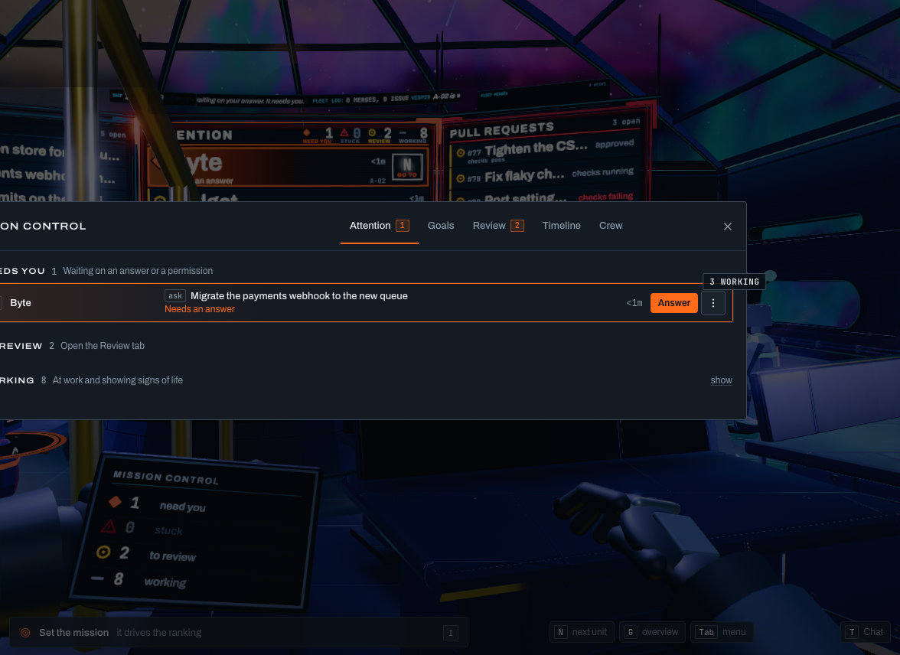

### The forward lounge

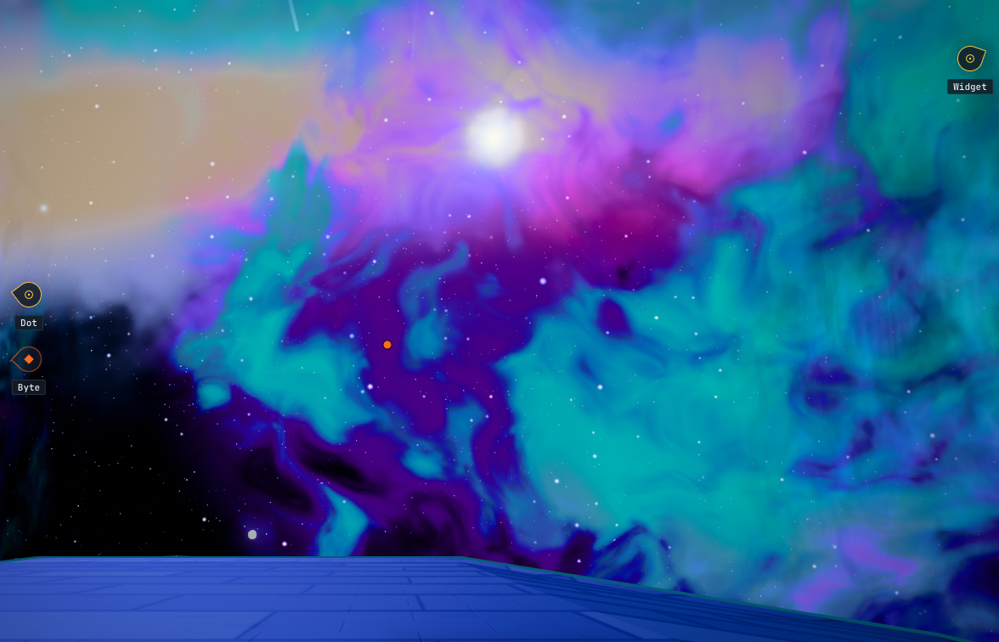

A balcony at the bow behind the arc (`src/client/features/lounge/`, [the deck](deck.md#the-forward-lounge)) for looking out at space: climbed by a ladder, three lounge seats along the glass. It keeps the room's rules. It is built in the hull's zone of value (graphite, deck plate, brushed steel rails), and its only lights are the tiers' ship-cyan lip along its nosing and the ledge, a warm white of low chroma under its seats and in its underside, never a state's hue. From the captain's chair nothing of it stands over the arc's foot.

- **The climb.** An activity (`ctx.activities`) with hold of you through `PlayerController.rig`: the eased walk onto the ladder, hand over hand up it, the smoothstep step over its head with a 12 cm hop, and the head turned the short way round, after upstream agent-office's ladder. Each gloved hand is planted on a rung in the deck's own space (`features/lounge/grips.ts`) and stays there while your body moves past it; once the lower one is down at your chest it lets go and goes over the other to the next rung in 0.15 s, and the rung's clank plays as it lands, so what you hear and see line up. Over the balcony the hands climb the grab posts. Your eyes follow your hands, so they stay in the frame. Its hint says which way you're going and the key that turns you round. Less motion makes it an even climb with no hop.
- **The view.** Sat in a lounge seat in first person the field of view eases 9 degrees wider (a cut with less motion) and the view lifts to 0.2 rad over the horizon, so the stars fill it. While you sit there only a unit that needs you or is stuck keeps its arrow at the edge of the view; the review arrows step back. A slim readout on the glass in front of the seats (`features/lounge/readout.ts`, drawn only while you're up there with something to say) names a unit that needs you in its hue, with its glyph and N to go straight to it, pulsing as the Attention card does; with nobody calling it counts a waypoint's jump in, JUMP IN and the seconds, in ship-cyan. The hands step out of it as in any seat. The boards are behind you, so nothing over the glass but space, the destination ahead, the flybys and, at a waypoint, the jump's tunnel straight ahead.

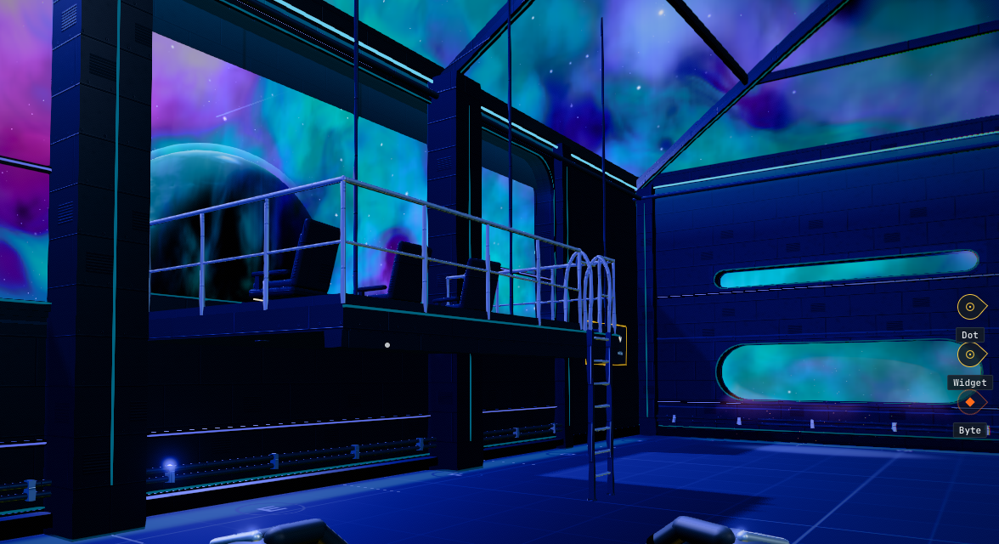

### The look: value, light and colour

The room reads in three zones of value from the chair, so the eye knows where to go even in a thumbnail: a dark hull, the stations and the crew in the middle, and the information plane (the arc's type and chrome) bright on its own dark backing, with a saturated universe over it.

- **Value.** By Night the hull sits at luma 6 to 30, the stations and units at 40 to 120, the arc's type at 170 to 235. The grade sets the floor (`features/cinema/grade.ts`: a black point, a film toe under 0.3 luma, vibrance; no tint in the darks) and the haze is a floor fog under about a metre (`features/atmos/fog.ts`).
- **A warm and cool key.** Cool blue-indigo starlight (hue about 230) from over the bow and low from either side rims the tiers and the units; the pods' lamps are a warm white, and a gold practical glows in each station's footwell with a soft pool on the deck (`features/bridge/stations.ts`), the same gold as the dais's lip. Each light's colour stays out of the state hues (`tests/lights.test.ts`).
- **Hull detail.** Lit channels run along the walls at the ribs' heads and over the trays and up each rib, in the starlight's indigo (`world/office/greebles.ts`, two instanced draws).
- **Units with faces.** A unit's suit is two-tone (lighter plates over its band), its visor dark glass with a glint along the top and an eye stripe lit in its band's colour, and its shell has a fresnel rim in its state's colour: ship-cyan at work, orange needing you, red stuck, amber to review, violet just merged, cool steel standing by. All of it in the shell's and the lights' existing shaders: no draw is added (`world/character/unit-body.ts`).
- **Stations never dead.** Every station screen has a faint ground in its colour and a fine grid; an empty console runs a slow standby trace, a working one a waveform over its bars (`features/life/panels.ts`).
- **Space.** The galaxy band bright and coloured, the nebula vivid (magenta, indigo, teal), the sky dimmed behind the boards; by Day a sunlit planet's limb across the canopy (see Space outside the glass). The destination world sits off to port.
- **The spotlight** (`features/spotlight`): while a unit needs you or is stuck, a dark ring settles round it on screen (the most urgent one) and a lighter one round the Attention board's rows, over 0.6 s, through the grade. Nothing inside a focus or on a board's face changes. With the duck to 60% for 2.5 s on a new call and the spectacle at 85% while anyone waits, a call reads as a beat and a spotlight, never as the room going grey.
- **The table** is instrument-black glass, so the holo and the course read on it, not a lit grey disc.
- **Medium** keeps all of it: the grade, the glow at half size, the rims, the sky. **Low** keeps the hierarchy (the arc, its backing, the signals, the hue rules, the sky's band and nebula, which are baked once) and drops the shafts, the mirror, the grade and the glow.

### Materials and the quality tiers

The deck is a working ship rather than a grey model, and every tier draws the boards, the marks and the callouts the same.

- **Finishes and the trim atlas.** Each surface has one of four finishes (`FINISH` in `world/office/materials.ts`): brushed steel and rails at roughness 0.35, the consoles' glass tops at 0.1 (they mirror the boards and the holo), wall and deck plate at 0.6, and 0.85 for rubber only; the units' shells are their own (a two-tone satin suit, below). One 1024 atlas baked at start (`world/office/trim.ts`) carries panel seams, bolt rows, vents, dirt in the seams and polished wear, with a normal map from a Sobel pass over its height, all in one RGBA texture (5.6 MB with mips). It is cast on every matte surface from the world's axes, so no mesh needs uvs, and every trimmed material shares one program (its strength is a uniform).
- **Detail at no draw cost.** Consoles, hoods, the Standby bench and the lecterns have rounded edges; cable trays, conduits, clamps and lightening-hole ribs run along the walls in four instanced draws, casting no shadow (`world/office/greebles.ts`).
- **Light that reflects the room, not the sky.** A probe over the table sees only what gives light (practicals, boards, strips, the holo) and is the inside's environment; a second sees only the sky and lights the hull's outside (`features/ibl`). Each is a 128 cube captured a face a frame and prefiltered once, at load and again on a change of lights, Brightness or alert condition, never every frame, so the floor's polished walkways and the console tops never move with the stars. Its diffuse share is a fifth: the room is lit by its lamps, and the probe is for reflections. The floor's reflection is box-projected onto the deck's walls (`world/office/floor.ts`).
- **The static deck in a few draws.** Once a floor arrives, every opaque mesh that has stood still since the frame before, and the flat paint on the floor, is merged into one mesh per material (`features/merge`). The originals stay in the scene on a layer no camera draws, a click on a merged mesh lands on its original, and one that moves, hides or changes is split back off within four frames. Parts under 0.3 m cast no shadow of their own.
- **Quality.** Settings > Bridge > Quality is Auto, Low, Medium or High (`features/quality`, the table in `tiers.ts`), published to the parts that draw with it. Auto starts from `WEBGL_debug_renderer_info` (Apple silicon or a discrete GPU High, integrated Medium, software Low) and judges the frames as they come (`Governor` in `governor.ts`). The first 6 s are thrown away, and so are 4 s after anything that hitches once: a Night and Day switch, a tier change, a floor arriving or a trip between decks, a jump under way, the tab coming back, a terminal's history arriving or 64 KB of terminal output inside a second (`quality.suspend(ms)` for anything else). It steps down one tier only when the rAF p95 stays over 22 ms through 10 s, never twice inside 60 s; it climbs back one tier after 30 s with the p95 under 12 ms, or on a 60 Hz display with every frame on its refresh (p95 within 15% of a median of 17.5 ms or less). A tier it climbed back to that fails again inside 2 minutes stops the climbing for 10. On graphics that start at High it holds at Medium unless the p95 stays over 30 ms through 15 s. A step down is kept for a reload under `agent-office.quality-cap.v2` with the graphics, the tier, the time and the browser session (`cap.ts`): a new session or a day later starts from the top, and the first version's key, which had no expiry and could hold Auto at Low for good after one slow minute, is deleted on sight. Settings > Bridge > Quality shows a live chip under the row, a three-bar meter and *Auto - running at High* with the last step's time and reason (*stepped to Medium at 14:02, slow frames*), and the HUD menu (Tab) has a Quality row under Deck that says it in two lines at most (*Auto - Medium since 14:02, slow frames*) with a one-click *Try High* that forgets the cap and closes the menu back to mouse-look (`status.ts`, `menu.ts`). The 2D view offer at 50 ms stays the floor. High: 1.5 pixels per CSS pixel, the full glow, a 2048 shadow map every frame. Medium: 1.25, the glow at half size, a 1024 map at 20 Hz. Low: 1.0, no glow, a 1024 map drawn again only when someone moves, two star layers, and no room light, sky light or trim. The light round the deck (below): High hangs every shaft, 1,500 motes and the floor's mirror of the boards; Medium the canopy's shafts and 800 motes; both the canopy's ribs and the light from outside; Low only the haze and the pools. The cinema (below): High smooths the edges with SMAA, Medium with FXAA, both with the grade, the screens' character, the arrival and the breathing; Low with none of them. Everything a tier changes is a uniform, a target size or a pass, so a switch never recompiles; the lights compile the deck for Night's and Day's paths once after load, so a Night and Day switch only retunes the lights.
- **Draw budgets.** A frame from the conn with twelve units at work may make at most 400 draw calls at High (the shadow pass included), 330 at Medium and 280 at Low (`DRAW_BUDGET` in `tiers.ts`, pinned in `tests/quality.test.ts`); `design/perf-probe.mjs` says on each conn line whether the frame kept to it. They were 601, 478 and 459. A unit's shell (column, torso, head plate, its bevel, both arm blades) is one skinned mesh over three bones (the figure and each arm's pivot), its band, visor and head hairline one unlit mesh whose shader picks each part's colour from the materials worker.ts already sets, and its disc and neck one more: fifteen draws and five shadow draws a unit became nine and one. A laptop's bezel and plinth are one skinned mesh over the lid's hinge. The floor's grid bubbles and ready-line numbers are painted into one decal sheet (`DecalSheet` in `world/office/floorpaint.ts`), a box painted face by face is gathered by paint (`paintedBox`), and the flat glass and the holo's added light draw both sides in one pass. Each tier has a detail range (`detail`: 20 m at High, 13 at Medium, 7 at Low) past which a unit's disc and neck, stripe, chest mark, provider letters, contact shadow and its laptop's hairline are left out; its band, ring, glyph and callout are drawn at every distance. The motion layer (everything Ship motion turns off) may add 0.6 ms to a frame at High, 0.4 at Medium and 0.2 at Low (`MOTION_BUDGET_MS`); the probe measures it as Ship motion on against off.

### Light and atmosphere

The room is lit by the ship and by space outside, and you can see the light in the air: shafts under the glass, dust in them, a low haze, pools on the floor. It all lives in `features/atmos`, laid over the light rig without adding a light to it, and it never touches what the captain reads.

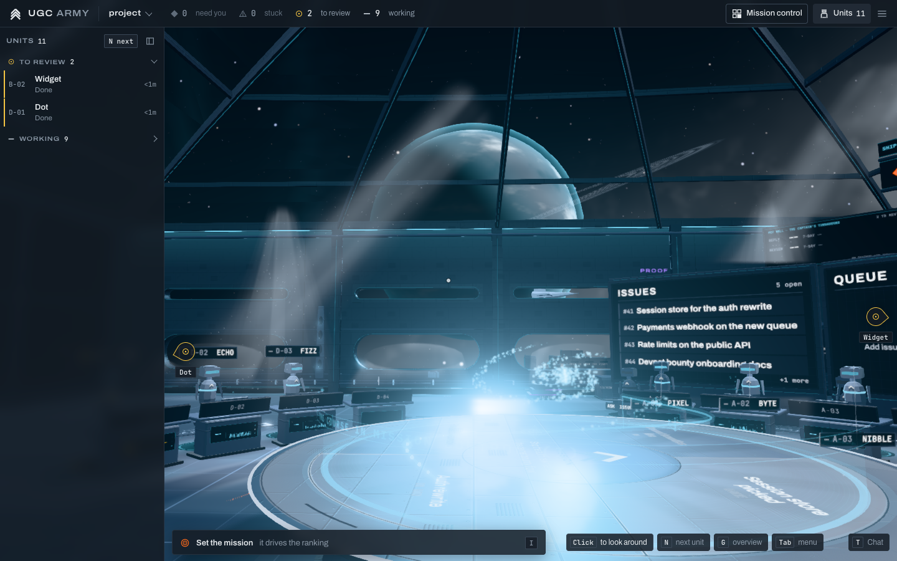

- **Shafts of light** (`shafts.ts`, the list in `plan.ts`): under five of the canopy's panes (three over the wall, one either side of the table), falling the way the key light's shadows do, and in at each low side port; none stands over a station, so no beam of haze washes out a unit's state. One merged mesh, one additive draw. A fragment's light comes from how thick the shaft is along that look (through its middle bright, its silhouette gone, and more seen down its length), how far along the shaft it is and how high off the floor, with slow rays of dust drifting down it; no depth texture, and the eye can stand inside one. On the axis it adds 0.1 linear by Night (at most 1.6 times that seen end on), half the first look's, in the sun's warm colour, and six tenths of that by Day: a tinted streak of sunlight, never a grey wedge. Like the holo, a shaft fades to nothing where a wall board's face is on screen, and where the band or the ticker over the arc is behind it.
- **Dust** (`motes.ts`): 1,500 points that live in their shaft's own terms (how far along it, how far from its axis, which way round), so they drift only inside the light and show only near its axis. One draw; Medium draws the canopy's 800.
- **Height fog** (`fog.ts`): the fog chunks replaced at load, before anything compiles with them. The distance fog stays as it was (to the void, so what's far outside still sinks into space and the Overview's own near and far still fade the slab), and over it lies an exponential haze, a floor fog held under about a metre (it thins by e every 0.55 m up), integrated along the line from the eye, never covering more than a fifth of what is behind it, in a colour that takes the hue of the sky ahead. Only ALU, every tier.
- **Pools of light** (`pools.ts`): soft quads on the floor under the boards, round the holo table out to just short of the ready lines, on the table side of each console, along the cove and inside each side port, in one instanced draw. Each follows its source: the holo's with its uplight and the consoles' with the pods' lamps (so the alert, Brightness and the jump move them), the ports' with what passes them. They are drawn before the units' marks, whose instrument black writes over them.
- **The canopy's ribs** (`cookie.ts`): the table's spot carries a small texture of the canopy's 16 ribs and its halo ring, so its light on the table and the deck round it is striped by their shadows, turning a full turn in ten minutes and leaning toward a passing planet. It is set at load (a spot with a map is part of every lit material's program) and only its contrast changes after: none at Low, at an alert condition or in Silent running.
- **Light from outside** (`outside.ts`): the sky showing is baked small (32 by 16) once per region and read back without waiting on the GPU; once a second the key and the fill ease over 2 s toward the hue of the sky ahead and abeam, never their strength. A passing planet swings the rim on its side round to come from it, in its colour, a comet or a meteor lifts the other rim from where it is, and the jump's flash washes the floor (a pool over the whole deck, drawn only while it's lit) and the units (through the fill from above) ship-cyan, at most 0.08 linear.
- **The floor's mirror of the boards** (`mirror.ts`, the GLSL in `world/office/floor.ts`), at High: for each point of the polished floor its shader follows the eye's ray off the floor to each of the five boards, a rectangle it knows, and where it lands it reads that board's own picture, blurred by the floor's roughness and how far the ray went, only on the pit's floor and the centre aisle (the tiers and the deck round them stay plate) and never through the mission table. No second render and no draw call; a reflection camera drawing the room's glowing layer cost 187 draw calls a frame. Its GLSL is in the floor's program only from High on (software rendering compiles every line), so picking High after load compiles that one program again; nothing else ever does.
- **It gives way.** While a unit needs the captain or is stuck, the shafts, the dust, the ribs and a planet's wash stand at 85% (`GIVE_WAY_LIGHT` in `logic.ts`), after a duck to 60% for 2.5 s when the call comes in (`SPECTACLE_DUCK` in `features/giveway/logic.ts`); the holo's and the consoles' pools dim a little. What picks the waiting unit out is the grade's local vignette round it (`features/spotlight`), not a dimmer room. The attention marks are `fog: false` and carry their own light, and nothing here changes their hue.
- **Still when motion is.** Ship motion Off, reduced motion and Silent running hold the dust, the shafts' rays and the ribs' turn still; nothing runs in a hidden tab. Everything else that changes after load is a uniform or a light's colour, level or direction.

At High it adds three draw calls at the conn (the shafts, the dust and the pools), four while the jump's flash is lit; the numbers are in `tests/atmos.test.ts`.

### Space outside the glass

Looking out of a port should feel like looking out of a ship: depth, a body close by, and light you could squint at. The sky behind it all is `src/client/features/space/sky.ts`; what is close by is `src/client/features/vista/`, plugged in with one line in `main.ts`.

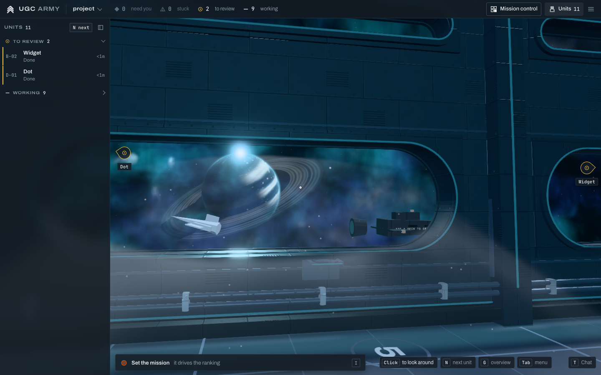

- **The sky** is still baked once per region into a 512 cube, now with more in it. The gas is baked many times brighter than white, so the live sky rolls it off under a cap (`SKY_CAP`: 0.36 by Night, 0.62 by Day, the planet's limb too) with its hue kept: under the glow's threshold and the tone mapping's shoulder, it reads deep magenta, teal and indigo rather than a pastel haze over the canopy and the arc, and the star points are added over it, crisp. The nebula is domain-warped fbm twice over, with ridged filaments lit through it and crisp lanes of dust dark enough to read against it, teal where the gas is dense, indigo where it is thin and a deep magenta heart, with a lobe of it out of each side's ports so they no longer show grey haze. The galactic band is bright enough to read as a galaxy from the chair: near-white arms, a warm white core and dark dust lanes, with lanes of magenta and teal gas along its two edges and indigo between, and the whole sky pushed in saturation so the tone mapping doesn't wash it to pastel. Behind the wall boards and just round them the sky sinks to a quarter, so the arc always has a dark ground behind its glass. The nebula's emissive knots are baked into the cube's alpha and added back live in their own gas's hue, so they can dim while something needs the captain and keep clear of the wall boards' faces (0.12 of the screen round each). By Day the ship is in high orbit over a sunlit planet (`DAY_PLANET` in `sky.ts`): a sphere seen from its own orbit, so its ground foreshortens toward the limb, with oceans, land and cloud from noise, bluer through the air toward its edge and a bright atmosphere's glow over the limb, which arcs across the canopy over the arc from the chair; space over it is dimmed. It is fixed to the ship, not the sky's slow turn. The bake takes about 8 ms on an M3 Pro (113 ms in software rendering), done once at load behind the loading screen and once per jump in idle time.
- **Dust streaming past** (`dust.ts`): four sheets of gas and dust each side of the ship, 38 to 92 m out, streaming aft as the ship makes way, the nearer ones faster, so a port has parallax as the ship moves and as you walk past it. One mesh and one draw for all of them, reading one 512 by 256 texture baked at start; a layer a tier leaves out collapses in the vertex shader. Their glow is added and their dust darkens what is behind it. Seen at a slant (out of the forward glass or the canopy), at their ends and toward their top and bottom they fade out, so only the side ports look onto them. A surge's streaks thin them and the jump's tunnel hides them.
- **The giant** (`giant.ts`): a ringed gas giant out of the port side on arrival, about a third of a port across, in the sky's blue-teal and slate. Its face (bands stirred by turbulence, a big pale storm and a few small ones) is baked once per region into a 1024 by 512 map and turns slowly. The light on it is the sun's, from where the room's key light comes, so its terminator agrees with the shadows on the deck. The ring's shadow falls across its face and its own shadow across the ring, each worked out per pixel against the other's shape, and its atmosphere glows past the limb on the lit side. Two draws: the planet with its glow (one sphere, ray-traced inside) and the ring. Each region has its own giant (`region()` in `sky.ts`), always abeam and never in the forward glass, and a passing planet keeps to the other side.
- **The sun's flare** (`flare.ts`): where the key light comes from, high over the bow. A glow, fine rays and a short streak at the sun, and hexagonal and ring ghosts along the line through the middle of the view, leaning from warm white to ship-cyan, all in one additive draw. The glow sits at the far plane against the depth buffer, so a rib or the halo ring crossing the sun cuts it pixel by pixel. The ghosts only come when the sun is clear of the canopy's frame, which a raycast against the ribs, purlins and halo ring works out on the CPU (`canopyClear` in `logic.ts`), never a read of the frame. Each shape fades out where it would land on a wall board's face. From the captain's chair looking at the boards the sun is out of view; look up and it is there.
- **Quality**: four layers of dust at High, three at Medium, one at Low; the flare at Medium and High; the giant at every tier. Low still draws two star layers.
- **It gives way.** While a unit needs the captain or is stuck, the nebula's knots, the dust and the flare stand at 80% (`SPACE_GIVE_WAY` in `space/logic.ts`, after the same 2.5 s duck to 60%) and the giant's rim with them; the giant itself and the stars stay. Ship motion Off, reduced motion and Silent running hold the dust and the giant's turn still, and nothing runs in a hidden tab. The Overview doesn't see the vista (it is on the bridge layer) and nothing in it can be clicked.

At High it adds three draw calls from the conn and out of a side port (the dust, the planet and its ring), four while the sun is on screen. The tiers, the dust's parallax, each region's giant and the canopy's raycast are pinned in `tests/vista.test.ts`.

### The cinema

How the bridge is shot: an arrival on load, a hair of breathing at the conn, the moments framed, the screens with some character and one grade over the frame. It is `features/cinema`, installed with one line in `main.ts`. It moves only the camera, after your own view is set each frame, and it never touches what the deck says or how attention is ranked.

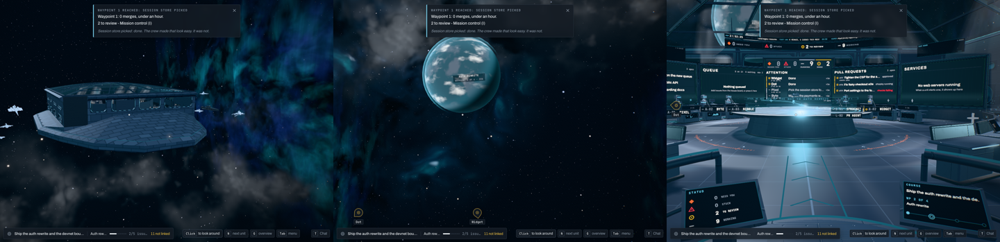

- **The arrival shot** (`arrival.ts`): on load, 5 s along a Catmull-Rom path, eased in and out: from ahead of the bow, high off to starboard, looking back at the ship and its escorts; up over the bow, turning to the destination world ahead; down through the canopy's glass between two ribs, clear of the halo ring; and onto your own view at the conn. It waits on its first frame while the loading screen fades. Outside the hull, the callouts and marks that draw over everything test depth, so the hull hides them. Any key, click, wheel or mouse move lands you on the conn the next frame. It doesn't play with reduced motion or Ship motion Off, when a unit already needs the captain or is stuck (the first frame is the conn), in a hidden tab, at Low or after the first floor of the page. The start of watch (the launch, the debrief) waits for it to land.
- **Breathing at the conn**: in the captain's chair, or standing on the dais in mouse-look, after 4 s with no input the view breathes, 0.6 of a degree of pitch over about 7 s, 0.3 of roll and 8 mm of lift (enough to feel the ship under you; a third of a degree still sat under notice), on sines between 7 and 11 s. It eases in over 2.5 s and is gone within a quarter second of any input. The ship's slow roll (under half a degree, a period of 47 s) turns the sky and the stars only, never the room or the boards.
- **A merge** eases the view, 60% of the way, toward a point between the Pull requests board and the escort that comes alongside for it (the first starboard escort, high in the canopy's glass over that board as the conn sees it), and back: 2 s in all. Input lets go of it.
- **The jump's three beats**: the spool pulls the view back from 55 to 60 degrees over 1.2 s; through the stretch and the flash the view lifts 7 degrees toward the canopy's middle and holds through the tunnel; the arrival settles both back over 1.1 s. It adds to the camera through the same zoom helper as the focus lean (`core/zoom.ts`), on top of the jump's own 8-degree punch.
- **The Overview** starts from a framed pose: from aft, the four work boards, the Attention board and the holo table in the upper two thirds of the screen, clear of the top bar and the Units rail (`core/overview-frame.ts`).
- **The screens' character** (`screens.ts`), in the shaders of the wall boards' faces and the holo only: on a board's dark ground, interlaced scanlines (every third row of pixels a little darker), a faint phosphor lift, a soft roll band sliding down it every 9 s, a 1 px chromatic fringe in the last 1.5% of the face and a hairline of ship-cyan round its bezel that grows toward grazing angles. None of it touches a texel brighter than the ground, and the roll band keeps clear of anything near type (a coarser mip of the board says where type is). The holo has fine scanlines 3 cm apart, a band rolling up it every 5 s and, every 20 to 40 s, a glitch: a thin slice knocked sideways for 220 ms, flickering on, off, on.
- **The trim's light chase**: a soft brightening runs round the deck along the cyan cove and the ports' bezels, a lap every 32 s, with a fainter one half a lap behind.
- **The grade** (`grade.ts`): one pass after tone mapping and before the edges are smoothed. A vignette, fine film grain in the shadows only (none at or over 0.3 luma, none on a wall board's face), a chromatic fringe at the frame's edges only (none inside 0.55 of the way to a corner, 1.5 px at most), a lens's dirt baked once at start and lit where the glow is, and the room's value structure: a black point and a film toe under 0.3 luma that sink the hull to black (the teal lift into the darks that greyed the room is gone), vibrance into what has little colour but never into a saturated mark or a bright neutral, and the practicals' neutral light a touch warm. Over it, the local vignette: up to two focus ellipses (`features/spotlight`, the waiting unit and the Attention board's rows) with a dark ring round each, never on a board's face (`focusDim` in `logic.ts`). The sums are `gradePixel` in `logic.ts`, and `tests/cinema.test.ts` checks that no state mark (needs-you orange, stuck red, review amber, working grey, proof violet, settled green, ship-cyan) moves more than 4% in any channel, and that at a corner each keeps its hue.
- **Quality**: High smooths the edges with SMAA (three passes), Medium with FXAA; both draw Night and Day through the composer with the grade. Low has no composer, no grade, no screen character, no arrival and no breathing (the canvas's own multisampling smooths it).
- **It gives way.** The arrival and the breathing play in every state, a unit waiting or not. While a unit needs the captain or is stuck, the framing of a merge or a jump lets go, the screens' roll band and the holo's glitch go still and the trim's chase fades out. With reduced motion or Ship motion Off nothing of it moves: the framing cuts in and out instead of easing, the grain holds still, and the chase and the roll hold where they are. Nothing runs in a hidden tab.

At High it adds three draw calls (the grade, and SMAA's three passes in place of FXAA's one); the trim, the screens and the holo are uniforms in programs they already had.

### The motion layer

Over the room's look sits a layer of motion design, so the bridge reads as alive and the captain sees a change happen rather than find it changed. It is four features, each a module of its own: `features/holoui` (the arc's faces in motion), `features/takeconn` (taking the conn and the gold chase), `features/hail` (the attention beats) and `features/kinetic` (the set pieces over the bow).

- **The budget.** Everything runs on time uniforms, instance attributes or one tween per event: no geometry is rebuilt per frame, nothing recompiles after load and no pass is added. A board's canvas is painted again only when what it says changes; the wipe, the typing, the odometer, the scan and the card effects are all in the face's shader (`holoui/faces.ts`, laid in after the cinema's screen character). A beat's flares, rings and couriers are an instanced draw each, drawn only while it plays. At rest it adds no draw call. `design/perf-probe.mjs` measures it as Ship motion on against off, at rest and with a hail held mid-beat; it may cost 0.6 ms a frame at High and 0.2 at Low (`MOTION_BUDGET_MS`).
- **Taking the conn** (`features/takeconn`): on sitting down in the captain's chair, and as the session's arrival once the cinema's arrival shot has landed. The view rises from behind the chair's back, clear over its headrest, and settles on the seated eye (1.1 s); the tier lips, the aisle's nosings, the dais's gold and the stations' footwells light a step every 120 ms from the pit up to the dais, each flaring and settling; the arc builds in, the Attention board first: each face wiped on from the bottom behind a bright scanline, its header typed on behind a block cursor, the Attention board's counts rolling up into place like an odometer, the chrome drawn round each face as it comes; and the armrest strips boot one after the other over 600 ms. About 3 s in all. Any key, click or wheel, or a real move of the mouse, skips it to the final framing on the next frame. A sit within 20 s of the last build only rises. At Low, with Ship motion Off or reduced motion it is a 300 ms fade with no rise.
- **The arc's chrome in motion** (`features/holoui`, `features/arcchrome`): an edge-light chase laps every board once every 6 s; a thin ship-cyan scan sweeps down the whole arc every 6 s at a sixth of the type's strength; a bright band sweeps a face's header when its data changes; a new card on the Attention board slides in from the right over 250 ms, the next one 120 ms behind; a bezel crossfades to the hue of a new state over 400 ms; an empty wing still folds to its pill (`features/boards/fold.ts`).
- **A hail** (`features/hail`), when a unit starts needing you, under 1.5 s: its station flares orange, a shockwave spreads over the floor from it, its beam climbs to the arc's foot under its card in 400 ms, and its card slides into its place at the top of the Attention board with orange chevrons sweeping across it. Its ship marker leaves the holo's route column, flies up the aisle and hovers in front of the dais with its call sign on a plate for 1.6 s, then goes back; VESPER names the unit. Then it is the steady diamond, beam and card.
- **Stuck**: a red flare and a small ring at its station, and on its card only, a red sweep once a second, its rim blinking at 1 Hz and a scanline tear for 120 ms of each second. Nothing room-wide.
- **Done**: a unit's work going to review flashes its card green; a green tick drops from the card into the holo, and the course fills from the table up to the ship.
- **Data flow**: dashes stream up every needs-you beam to its card; dashes run along the holo's course to the ship; the gold chase rolls up the tier lips to the dais every 8 s, faint, and bright when a waypoint is passed.
- **The kinetic type** (`features/kinetic`): one canvas plane on its own dark backing, just over the arc's ticker and under the milestone card, inside the seated frame, swept on left to right behind a bright line. It says WAYPOINT 2/4 CLEARED when a waypoint is passed; through a jump's countdown JUMP IN with the seconds big at its right on a lit disc, a ring wiping round the digit each second and the plate punching as a digit lands, the waypoint cleared and where to over it (the only place the countdown is shown: not on the band, not on the sky); and MISSION COMPLETE in the conn's gold. A long line shrinks to fit before anything is cut (`fitSize`). Its canvas is painted only when what it says changes; it draws nothing at rest.
- **The pulse** (`features/pulse`): the room at rest, in the top of the captain's frame where nothing is read. Every 7 s a wave of ship-cyan light leaves the halo over the table and runs out along the canopy's ribs to the eaves in 1.6 s, each rib 50 ms behind the last, so it turns round the dome like a radar's sweep; a glint turns round the halo every 5 s; and at High a wake of lit dust streams over the glass from the bow. All of it is animated on the GPU from one clock: two draws at High, one at Medium (the ribs and the glint), none at Low. Ship motion Off and reduced motion hide it, Calm and a call halve it.
- **The warp**: the room's light drops to 40% through the countdown, the stars streak, the arc folds flat toward each board's middle through the stretch and the tunnel, the flash is clamped (a third by Night), and the arc opens on the new system; about 3 s, with the HUD, the rail and every key live throughout.
- **The mission complete**: the galaxy brightens 30% for 6 s, the holo's course turns the conn's gold for 9 s, and five ship markers in a V pass over the pit.
- **Night and Day**: a 1.2 s iris of seven blades closes over the glass and opens on the new light, drawn with the sky so the room stands in front of it.
- **Ambient**: the holo's route turns 6 degrees a second, the nebula's knots shimmer as the gas drifts and the sky turns 3 degrees a minute, dust streams past the ports with parallax, the stations' screens scroll, the conn breathes 0.6 of a degree over 7 s, and something passes the ports every 40 to 90 s.
- **Less motion.** With Ship motion Off or reduced motion no element travels: the take of the conn is a fade, the beam is up at once, a hail's marker crossfades in at the dais and out over 400 ms, there is no shockwave, no fold, no pass and no iris, the words crossfade, and a call or a stuck card is a still outline in its hue. Colour and shape changes still happen. Nothing runs in a hidden tab.

## Motion

Motion marks a change of state, and hue and the attention cadences belong to state alone. The bridge's ambient life (the units' work, the stations, the holo, space outside) is achromatic or ship-cyan, slow, keeps off to the side of what you read, gives way when a unit needs you or is stuck, and stops under reduced motion or Ship motion at Off (DESIGN.md, rule 1). Every motion has a reduced-motion form, and Settings > Bridge > Ship motion (Full, Calm, Off) is the in-app switch: Calm halves space and drops its streaks, flybys and meteors, Off stills everything as the system's reduce-motion setting does. Nothing in space plays while the tab is hidden, so coming back is never met by a flourish out of nowhere. Settings > Bridge > Life sets how much the bridge lives: Full; Calm, which drops the gestures (salutes, hail lines, patrols); or Silent running, which stops all ambient life, slows the stars to a crawl and pauses the ticker, while every attention state keeps its full strength. Each part of the world outside (the destination, the fleet, the squadron) and of the crew (crew epithets, the bridge droid) has its own switch there too, and Ship's voice sets how VESPER speaks. Settings > Bridge > Moments sets the celebrations (Full, Cards only or Off) and the alert conditions (on or off, and their minutes); Settings > Bridge > Rituals sets the start of watch (Full, Debrief only or Off), the momentum display and the turnaround clock. The UI uses one curve, `--ease` (`cubic-bezier(.2, 0, 0, 1)`), and three lengths in `tokens.css`: `--t-ui` 120 ms, `--t-pulse` 1.2 s and `--t-flight` 700 ms.

| Moment | What moves | How long | Under reduced motion |
| --- | --- | --- | --- |
| A window or toast opens | fades in and rises 4px | 120 ms | appears |
| A count on the top bar changes | the number rolls in from the way it moved | 120 ms, once | changes |
| A unit starts to need you | its ring pulses (scale 1 to 1.35, fading out), it glides to its tick on the ready line, the edge of the screen flashes | pulse every 1.2 s, glide 0.6 to 1.5 s | a still ring, a cut |
| A unit is stuck | its band blinks, its hatch fades in | 0.5 Hz, 200 ms | a steady band |
| A unit works | its visor brightens as its terminal prints | follows the output | the same: it is a reading, not a decoration |
| A unit is deployed | a light runs from the mission table out to its console | 400 ms | nothing runs; the unit appears |
| A pull request merges (the merge beat) | a violet pulse from the unit's console to the table, whose rim lights; then a ring of violet light sweeps out across the floor, the Pull requests board flashes green, a ring rises off the unit's console and every lit line on the bridge swells | 300 ms, rim 800 ms, the sweep 1.2 s | the board and the lines hold a colour for 1.2 s |
| A bounty is funded | its coins drop onto its stack over the vault, one after another, and its row on the Issues board takes the amount | 9 coins a second | the stack is there at once |
| A bounty is released on devnet | the pulse runs on to the Proof corner and up the rail, parks as the new lit segment, the vault lid lifts, then the proof toast; the bounty's coins fly from the vault to the unit's console and a receipt floats up there with the devnet transaction | 600 ms, lid 2.4 s, the flight 1.5 s plus 90 ms a coin, the receipt 6 s | the segment and lid change at once, the toast, and the receipt is there over the console for 6 s |
| A unit gets an ERC-8004 record | the plinth glows violet as its step lights | 1.2 s | the step lights |
| You use something in first person (E or a click) | your right hand reaches in toward the crosshair, its index finger straightens and taps, its fingertip lit ship-cyan at the press | 420 ms | nothing moves |
| Mission control opens, in first person | your left hand brings a datapad up into the lower left of the view, and takes it down again when the window closes | about 300 ms | it is there, or gone |
| You go to a unit (N, a toast, search) | in Walk the view flies there in an arc; in the Overview it pans and zooms in (never out), fast and then settling (ease-out quint), the unit landing in the middle of the deck you can see | 700 ms; 900 ms | a cut |
| You go up into the Overview, or back down (G) | the view rises from your eyes, its field of view closing onto the deck's framing, and lands on the orthographic view with nothing popping; down, the same move backwards into your eyes. The key legend fades in once it lands | 650 ms; the legend 150 ms | a cut |
| The Overview turns (Q / E) | a quarter turn | 280 ms | a cut |
| The Overview, left alone | it drifts by half a degree and 15 cm, on sines of 40 s and longer that never line up; any input stops it where it is | after 8 s idle | still |
| The bridge, always | the holo's route column turns over the mission table, in ship-cyan, a band of light climbing its scan rings, a small star map turning in a cone of scanlined light, dashes running up the course to the ship; the ticker over the strip runs the deck's log and its clock ticks | a turn a minute (6 degrees a second); the scan every 3 s; a dash's run 5 s; the log its width in 70 s; the clock each second | still (the clock still tells the time) |
| A unit works, at its station | it leans in over its console, its hands stay at it and work it harder while its terminal prints, its head bobs a little, its ship-cyan halo breathes faster as it gets busier, motes of cyan rise off its screen; its station's bars scroll and grow with the output, a scan line passes, three blinkers twinkle | follows the output; the scan every 6 s; blinkers every 4.3, 6.1 and 8.9 s | the hands rest; the bars hold still at their height |
| A busy station | a data pulse in a low ship-cyan arc from its hood to the holo table | 1.6 s, every 1.8 to 6 s by how busy | none |
| A unit works, nobody waiting (Life at Full) | now and then it glances across at the next screen | 1.6 s, every 8 to 15 s | none |
| A unit finishes (its work to review, or merged) | it stands up off its console, arms up, leans back and settles, once | 2.4 s | none (Calm too) |
| A unit is stuck, at its station | it slumps lower and sighs; a slow red breath of light over its desk | a sigh every 9 s; the light every 5 s | the slump and a steady light |
| A unit needs you, at its station | it turns toward the conn (at most about 70 degrees) with a hand up | eased over about a second | still |
| A unit needs you | an orange diamond turns and bobs half a metre over its head, a beam of orange light runs from it to the arc's foot under its card with a pulse climbing it, a wave spreads on the floor | a turn in 4.5 s; the pulse every 1.6 s; a wave every 1.2 s | a still diamond and a steady beam |
| A unit is stuck | a red triangle over it blinks, a red rim lies round its station | 1 Hz, lit 62% of each second | a steady triangle |
| A unit's work waits for review | an amber ring of three arcs turns at its feet | a turn in 18 s | still |
| Someone needs you or is stuck | a run of light chases round the Attention board's chrome, in its hue | a lap in 3.2 s | still |
| One of them is out of view | the wing on its side brightens; three chevrons step outward along the arc's foot under it | 1.1 s a step | still chevrons |
| An empty Queue or Services | folds to a pill, the board over it growing down into the room | about 0.5 s | a cut |
| A unit starts needing you or gets stuck | the bridge's ambient life dims to 40%; that pod's stations stay hushed while it lasts; a quarter quieter everywhere while anyone waits on you | 3 s, then for as long as it lasts | (already still) |
| Space, always | three layers of stars stream past the glass, the sky turns, the nebula's knots shimmer as the gas drifts, the drive glow breathes | the ship's speed (0.4x to 1.6x by merges in the last hour, 0.15x holding station), the sky 3 degrees a minute, the glow every 8 s | still |
| Now and then | a planet or moon (clouds, a lit limb, a ring round a gas giant) across a side port, an asteroid field tumbling past, or a comet across the forward glass; never during a beat, waiting while a unit has just started needing you | every 40 to 90 s; 90 to 180 s, 40 s, 25 s | none (Calm has none either) |
| Often | a meteor streaks across the sky | every 20 to 40 s, 0.7 s each | none (Calm has none either) |
| A pull request merges | the surge: the stars speed up to 12x and streak (half that while you walk), the glass glints ship-cyan | 1.4 s, at most one in 20 s | nothing; Calm keeps only the glint |
| A milestone is done (a waypoint) | the jump in three beats. The spool-up: a countdown, 3, 2, 1, said once, big on the kinetic type plane over the arc with WAYPOINT 2/4 CLEARED beside it, the room's light let down to 40%, the arc folding flat, the edges of the view breathing ship-cyan once a second (and with sound on, the drive spooling up). The punch: the escorts streak away 150 ms apart, the stars stretch toward the bow, the view kicks about 8 degrees wider as a white-cyan glint comes up over the glass and a tunnel of bright ship-cyan and white streaks opens round the ship (a third by Night, half by Day, lifted past that for its first 0.6 s only, added to the sky so the room still passes in front), the room lit cool from the glass (with sound on, a release falling away). The arrival: the ship comes out in new space, the next world swings into the glass, the next waypoint's name in the right-hand pane, the light leans warm before settling and the escorts drop back into their slots | the countdown 3 s; the jump 3.9 s (the tunnel 1.5 s); the swing 2.6 s; the name 3 s | the new space crossfades in over 400 ms with the name, Calm and Silent running too |
| The page loads (the arrival shot) | from ahead of the bow, past the destination world, down through the canopy to the conn; any input lands on the conn | 5 s, eased in and out | the first frame is the conn (so too with a unit waiting) |
| The conn, 4 s with no input | the view breathes 0.6 of a degree over 7 s, 8 mm; the sky and the stars roll under half a degree | sines of 7 to 11 s; the roll 47 s | still |
| A pull request merges (the merge frame) | the view eases toward the Pull requests board and the escort coming alongside in the canopy over it, then back | 2 s; the escort 6 s | a cut in and a cut out |
| The jump's framing | the view pulls back from 55 to 60 degrees at the spool, lifts 7 degrees to the canopy through the tunnel, settles at the arrival | 1.2 s; 1.1 s; 1.1 s | cuts |
| The screens, always | a roll band down each wall board's dark ground, never over its type; a band up the holo; now and then a glitch slice on the holo; a light chasing round the cyan trim | 9 s; 5 s; every 20 to 40 s for 220 ms; a lap in 32 s | still |
| You sit down in the captain's chair, or the session arrives (taking the conn) | the view rises over the chair's back; the tier lips light pit to dais; the arc builds, the Attention board first, each face wiped on with a scanline, its header typed, its counts rolling; the armrest strips boot | 1.1 s rise, 120 ms a step, about 3 s in all; any input skips it | a 300 ms fade |
| The arc, always | an edge-light chase round every board; a scan down the whole arc; a header's sweep when its data changes; dashes up every beam | every 6 s, a lap in 1.5 s; every 6 s, 1.8 s; 600 ms; steady | still |
| A unit starts needing you (the hail) | its station flares, a shockwave spreads on the floor, its beam climbs to its card, its card slides into the top of the Attention board with chevrons, its ship marker flies from the holo to hover by the dais with its call sign | under 1.5 s; the beam 400 ms; the marker 0.6 s out, 1.6 s hovering, 0.7 s back | the beam up at once, the marker crossfades in and out, the card a still outline |
| A unit gets stuck (its card) | a red sweep across its card, its rim blinking, a scanline tear | once a second, 1 Hz, 120 ms of each second | a still red outline |
| A unit's work goes to review | its card flashes green, a green tick drops from it into the holo, the course fills to the ship | 900 ms; 1.4 s | the flash only |
| A waypoint passed | WAYPOINT 2/4 CLEARED sweeps onto the type plane over the arc; the gold chase runs up the tier lips to the dais | 2.6 s; 1.4 s | it crossfades; no chase |
| The tier lips, always | a faint band of the conn's gold rolls up them to the dais | every 8 s, 1.4 s | still |
| The mission complete (the beat) | MISSION COMPLETE in gold on the type plane, the galaxy brightens 30%, the holo's course turns gold, a V of ship markers passes over the pit | 4.6 s; 6 s; 9 s; 3.2 s | the words crossfade, the gold and the light change, no pass |
| Night and Day switched | an iris closes over the glass and opens on the new light | 1.2 s | none |
| A waypoint while a unit needs you or is stuck | the jump waits: a JUMP READY chip on the Attention board's header (never on the band); it counts down once nobody waits and the bridge has stood down; held two minutes it is the crossfade; a call mid-jump cuts it to the crossfade at once | up to 2 min | the crossfade |
| The hull, from outside | red and green running lights breathe, white strobes double-flash at the bow and the nacelles | 2.4 s; every 1.8 s | steady |
| The destination ahead, on real progress (a waypoint passed, an issue closed on the open one) | the mission's world, low in the canopy's left-hand pane and about a quarter of the view from the first waypoint, grows toward a third of the view | eased over 4 s | a cut to the new size |
| The destination ahead, always | it turns slowly | a turn in 50 minutes | still |
| Every waypoint passed (the arrival, waiting behind anyone who needs you) | the ship drops into orbit: the world fills the canopy, the band says MISSION COMPLETE | 30 s, once | a 400 ms crossfade and a card |
| The fleet, always | each sister deck's escort bobs in its slot off the side ports, its drives pushing by the share of its units at work | a period of 6 to 12 s | still |
| A sister deck merges | its escort eases a ship-length ahead, then drifts back to its slot | 1.4 s ahead, back by 20 s | none |
| A sister deck reaches a waypoint | its running lights blink twice (a salute), a hail line in the canopy's corner | 0.84 s; the line 6 s | the line only |
| A sister deck's clone finishes | its escort, built plate by plate in a slip while it cloned, drops out of hyperspace into its slot | 1.2 s | it is in its slot |
| A unit works | its fighter patrols past its pod's side port, its engine ship-cyan, quicker and brighter the busier it is | a loop every 8 to 14 s | still |
| A unit's pull request opens, or closes unmerged | its fighter peels to the picket ahead of the bow, or back to patrol | 3 s | a cut |
| A unit's pull request merges | its fighter runs home over the canopy trailing ship-cyan and lands as the merge beat fires | 300 ms, the trail 1.2 s | it is home |
| A unit needs you or is stuck | its fighter cuts its engine and drifts dark outside the glass; the escorts hold still, salutes and hails are dropped | for as long as it lasts | (already still) |
| A real event on this deck (a merge, a waypoint, a mission set, a bounty paid, a merge attested, a hire), or 40 and 120 minutes with nobody waiting while units work | VESPER's line fades in as a caption low over the view and rides at the head of the ticker's log | the caption 9 s with a 400 ms fade; at most one line in 90 s | the caption appears and goes |
| A unit starts needing you or gets stuck | VESPER says one plain sentence ("B-03 is stuck: tests or build failing. It needs you."), then nothing until it clears, then one line about the recovery | once | the same |
| A unit finishes (done, to review) | Bolt flies to its console at walking pace, its turret turned to it, reaches down with its arm, picks up a small ship-cyan crate of its work and carries it into the Review bay with a short ship-cyan trail behind it, hops as it sets it down, and the crate fades | 1.4 m/s; the hop 0.6 s; the crate fades over 0.9 s | Bolt stays docked |
| A pull request merges | Bolt makes one slow turn by the holo table (not at Calm) | 2 s | none |
| Units at work, nobody waiting (Life at Full) | Bolt makes rounds of the busiest pod and pauses behind a working unit, its cap tilted; its hover breathes | a pause of 6 to 10 s; the hover every 5 s | docked |
| A unit needs you or is stuck | Bolt drops its errand, goes to that pod's entrance off the line from you to the unit's glyph, and holds completely still with its lens on the unit; no rounds while anyone waits | for as long as it lasts | (docked) |
| Three or more units at work, nobody waiting (Life at Full) | Kip runs laps of the pit lane, the Sprig held low with a short trail of rose-white motes, his scarf flying; after a run he bounces on his toes by the busiest pod, then rests 15 to 30 s; at Calm he ambles at 0.6 m/s with no laps or motes | 2.2 m/s at 5 to 6 steps a second, a run 25 s at most; the bounce 2 s | parked asleep in his nest |
| A unit finishes, Bolt carrying (at most once a minute) | Kip runs to meet Bolt at the console, jogs beside and a little behind the crate, races ahead into the Review bay and hops as the crate is set down | the hop 0.45 s | parked |
| A pull request merges (Life at Full) | Kip runs to the pit lane across the table from Bolt's turn, turns to face you, crouches and hops with the Sprig held up, spinning it twice round his paw like a pinwheel at the top, happy-eyed, with a ping; a unit's first ever merge adds a little bow; at Calm he only flaps his ears | 1.4 s; the bow 0.9 s | parked |
| A streak | Kip runs one weaving lap round the table, ears flat, and flops on his back, feet and the Sprig up | the flop 2.6 s | parked |
| A unit is stuck | Kip stops dead, then walks (never runs) to the foot of the front tier and tucks in under its lip, below your eye line from the conn; his way keeps out of the aisle's mouth and off the line from you to the glyph, and he never climbs the dais; crouched, ears laid back, the Sprig at 5%, completely still, breathing too; once it is working again he shakes himself off | 0.9 m/s; for as long as it lasts; the shake 0.8 s | parked |
| A unit needs you | Kip walks to the foot of its pod's tier, across its entrance from Bolt, outside its ring, off the line to its glyph and never square in your frame, and sits facing it, the Sprig dimmed to 15%; only his blinks move; one soft chirp when you answer | for as long as it lasts | parked |
| A waypoint's jump | Kip runs to the bow end of the pit, eyes wide, up on his toes through the countdown, waving the Sprig overhead with his ears blown back through the jump; on arrival a sneeze, a turn and a wave at you; not while anyone waits | the countdown and the jump | parked |
| You click him, or walk up to him | he turns to you, a curious chirp and a wave of the Sprig held up like a wand, then a moment more looking at you; a second click inside 3 s gets a happy wiggle; come closer than 1.2 m and he steps back, and he dithers out within a metre so the view never ends up inside him | the wave 1.7 s; once in 10 s by click, once in 2 minutes walking by | none |
| Nothing at work for two minutes | Kip walks to his nest under Bolt's charger, turns round twice and curls up, the Sprig his 20% nightlight; slow breathing and a soft snore now and then | a breath every 4 s | parked asleep |
| The unit of the watch, always | its hologram on the Proof corner's plinth turns | a turn a minute | still |
| A unit's first merge, or the day's first (Tier 1) | the merge beat, VESPER's line, and the other units of its pod turn to it with a quick nod | 1.5 s | the card |
| A unit stuck, resumed, then done or merged (the recovery, Tier 1) | one soft ring of white light sweeps out across its pod's floor; the band says "WIDGET (B-02) RECOVERED, 40M STUCK" | 2 s; the line 5 s | the card |
| Three merges inside an hour, nothing stuck (a streak, Tier 2) | hands up from the consoles across the ship, and the surge runs harder (20x) | 1.5 s; the surge 1.4 s | the card |
| A waypoint reached (Tier 3) | the crew stand and face the bow through the countdown and the jump, then the log card under the top bar with the real numbers | about 7 s; the card 30 s | the card |
| The mission complete (Tier 4) | the crew stand, the arrival in orbit, the escorts' slow fly-by ahead of the bow and back, and a card naming every unit that merged | the fly-by 24 s; the card 45 s | the card |
| A unit has waited past 5 minutes, or a reminder fired (CONDITION AMBER) | the room's lights step down a fifth, the cyan cove lines dim, the pod spots over the units that wait stay up; the band says why with the needs-you glyph | eased over about a second | a step |
| A unit stuck past 10 minutes, or three stuck (CONDITION RED) | one step further down, the stuck glyph on the band | eased over about a second | a step |
| The last call clears (the stand-down) | the band says STANDING DOWN - EVERY CALL CLEARED at once, never a red or amber line with nobody behind it; then the lights come up aft to bow and CONDITION GREEN - ALL STATIONS WORKING; then held celebrations go | up to 4 s; 1.5 s; the line 4 s | at once |
| The first visit of the day, or back after 8 hours (the launch) | the room's lights come up from near dark aft to bow, the pods' lamps one pod at a time; then a scanline wipes a flat panel onto the forward glass and the day's captain's log is typed onto it a sentence a line, in white under a ship-cyan heading; merge toasts wait until it is done | the lights 2.6 s; the log 4.9 s from 1.3 s (75 characters a second), about 6 s in all; any key, click or Esc skips it | a still card for 6 s (Silent running too) |
| The launch while a unit needs you or is stuck | the lights come up in 1.2 s, no log on the glass; the log is one line on the band; the debrief lists only who waits | 1.2 s | the card and the list |
| Back after 20 minutes away (the debrief) | a conn panel low on the left: who waits on you first, with a key to go to them, then what landed, then VESPER's closing line | 400 ms in; up 15 s, 30 s while it lists who waits | appears |
| A merge in the current run | a bright band climbs the drive core to the ring it lights, which comes up ship-cyan, bottom up; the collar's plaque counts the run | the climb 1.4 s; the ring 900 ms | the ring at once, no climb |
| Merges landing together | one toast gathers them ("3 PRs merged by Tess"); while the debrief is up they are left to it | 4 s to gather | the same |
| The drive core, always | it breathes, and its light runs up the column at the ship's cruise speed | a breath every 8 s; the flow with the speed | still; the rings keep the count |
| A revert or a pull request closed unmerged (the run breaks) | the lit rings go dim, the top one first; no flash, no sound | 4 s | at once |
| The fleet's week passes its record | one surge (its own 20 s gap holds) and NEW RECORD: THE FLEET'S BEST WEEK YET on the band, waiting behind anyone who needs you | 1.4 s; the line 6 s | the line only |
| A wait cleared faster than its seven-day median | a ship-cyan hairline runs once from the Review bay's door down the west aisle to the drive core, whose next breath swells; never while anyone else waits on you | 2.6 s | none |
| Three or more units wait for review | the pit wall and the Review bay's floor come up a step | at once | the same |

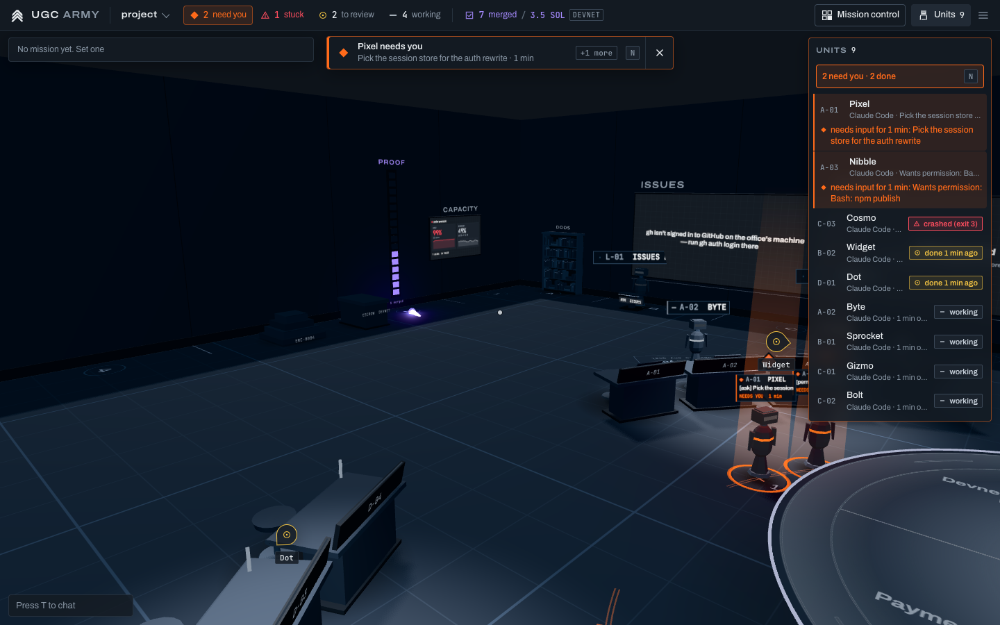

The merge beat is the one celebration, and the moment to record for a video: the bridge marks the merge across the deck, then the pulse leaves the table, crosses to the west wall and climbs the rail.

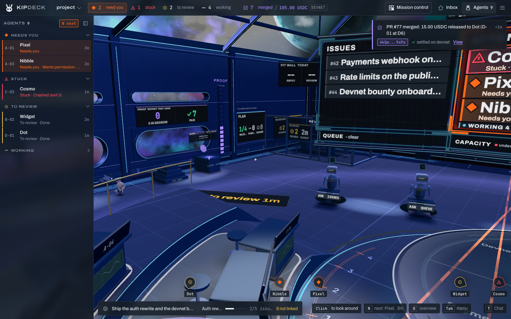

Once it parks, the rail has one more lit segment (the rail is a tally that grows), the vault's lid is up with a violet glow, the top bar's violet counter has rolled, and the proof toast shows the devnet transaction. The camera only turns toward the Pull requests board for 2 s (the cinema's merge frame), and not at all while a unit needs you.

### The world outside

The bridge sits in a world that moves with the work, and only with the work: nothing out there runs on a timer of its own or celebrates at random.

- **The destination ahead** (`src/client/features/destination/`): the mission as a world low in the forward canopy, off to port over the arc's port wing from the conn (30 degrees off the bow, so it frames the room rather than sitting behind the Attention board), its lower limb behind the ticker over the arc: a rocky world, a ringed giant or a station, the same one for the same mission, turning slowly. With a course of waypoints it is about a quarter of the view from the start and grows only with real progress (waypoints passed, plus the open waypoint's issues closed of those linked) to a third, eased over 4 s; with nothing to measure it is a bright point. Where the ship is making for ("AUTH REWRITE", "WAYPOINT 2 OF 4 - 35%", "- BEHIND 4 DAYS" while the waypoint is overdue, when it stops growing) is said on the course strip and the chair's armrest, no longer on a sign over the world, which covered it; the band is drawn on the sky only in orbit. After a jump the new world swings into the glass. The sky round it is teal and indigo with a deep magenta heart, clear of the reserved hues. Waypoints passed are small markers astern. With every waypoint passed, the ship drops into orbit and holds there until a new mission is set. With no mission, a dim unnamed star, and the strip's own *Set the mission*.
- **The fleet in formation** (`src/client/features/fleet/`): every other deck as an escort in a V off the side ports (one rank at a seated eye's height, the next high over the walls, so it shows through the canopy). A corvette for up to three units, a frigate to eight, a cruiser past that; one port lit per unit at work, drives by the share at work, its repository's name on its flank. A deck being cloned is built plate by plate in a slip. A deck with a unit that needs you carries the deck's own needs-you diamond over its bridge, on instrument black like every unit's ring, and clicking its ship opens the Decks lift. With one deck, one escort holds station captioned "ADD A DECK TO GROW THE FLEET". Eight at most; the hail strip counts the rest.
- **The Relay Beacon** (`src/client/features/relay/`): the fleet's relay station, high off the starboard bow through the canopy, seen from the captain's chair and the forward starboard glass. See [The Relay Beacon](#the-relay-beacon).
- **Squadron sorties** (`src/client/features/sorties/`): a fighter for each unit at work, achromatic with a ship-cyan engine. Open pull requests hold on the picket ahead of the bow, left and right of the destination, so the review queue is out there to see, with a mono count under it.

All of it is neutrals, blues, teals and ship-cyan, with one warm white in the Relay Beacon's lamp (chroma under 0.12, as the sun's); the only other hue out there is the needs-you diamond, and only where a deck really needs you. It gives way the way the bridge's life does (`src/client/features/giveway/`): for 3 s after a unit starts needing you or gets stuck, the patrols slow; in that unit's pod they slow to stillness while it lasts; the escorts hold still and their salutes and hails are dropped, not queued. A set piece (the arrival) waits behind attention and, held more than ten minutes, comes out as a card. The camera never moves for any of it. Ship motion at Off and reduced motion hold it all still and turn the arrival into a crossfade and a card; nothing plays in a hidden tab. It adds 12 draw calls in all (the world, its halo, ring and band, the markers; three hull classes, the drives, the names, the beacons; the fighters, their engines, the picket's count).

### The Relay Beacon

The fleet's relay station holds station high off the starboard bow: a lattice tower with a warm-white lamp at the heart of three nested rings that turn on their own, a slim mast up through them to a strobe, and a still docking collar at its foot with four arms of approach lights. It is an original object of the ship's world, built in code with no model or image files, and it carries no text and no mark at any tier, by Night or by Day. It is `src/client/features/relay/` (`logic.ts` its numbers, `geometry.ts` its draws, `index.ts` the install, `guard.ts` how it keeps off the boards, `fleet.ts` the units it carries), plugged in with one line in `main.ts`; it reads the merge, the payout, the jump's phases, give way, Quality, Night and Day and Ship motion and edits none of the parts that make them.

- **Its shape.** A triangular truss 120 m tall, 16 m across at its foot and 6 m at its top, braced every 20 m with one set of members at every tier (legs 5 m, struts 3.5 m, so every member holds at least a pixel from the chair and nothing finer crawls as it turns); an 18 m faceted lamp housing on top, at the rings' middle; a 3 m mast from the lamp to 228 m. Three rings round the lamp (radii 70, 96 and 122 m, bands 11 m across and 5 m thick, tipped 18, 52 and 74 degrees, their axes turned so that from the chair, the chair turned toward it and the forward starboard glass each is an open ellipse, never edge on). The collar holds still while the truss turns, and its arms are squared to the chair's line of sight, so from the conn they read level or upright and never as a bar slanting across a ring (`tests/relay-beacon.test.ts` projects the spire, the arms and the rings and fails on one).
- **Its own light.** The lamp is a crisp warm core, an 84 px halo and a 230 px wide one, larger than the whole structure, which is what sells a light kilometres off; the bloom takes it. The rings carry an emissive ship-cyan rim where their bands turn from the eye and a brighter hairline on their outer faces, and two tracers with fading tails run each ring at every hour, so the rings are never bare. The innermost ring's 32 ledger segments always glow faintly. Three shuttles run in from the dark to dock at the arms' tips, one every 9 s or so. The steel fades a little toward a haze blue, as a thing a kilometre and more off does. By Day the steel turns a light hull grey and the lights stand brighter and larger, so it reads lit on a pale sky.
- **Where it is.** 21.75 degrees to starboard of the bow from the seated eye, its foot 14.75 degrees up, 1750 m out: about 8 degrees tall and as wide, in the canopy over the arc's starboard wing. From the chair at 1440x900 its outline is clear of every board's face and 0.12 of the screen round it, and under the top bar (through the rings' slow wander). It is placed in the canopy pane where the lamp and the hub of its rings (50 m round the spire) are in clear glass from the seated eye, clear of every rib and purlin (the test raycasts the canopy as `vista/logic.ts` models it). The panes of the canopy over the boards are under about 90 px across from the chair, smaller than the rings, so a rib passes behind the rings' outer rims as a window frame does; no rib or purlin crosses the lamp or the hub. It is drawn round the camera on its own line of sight, as the giant is, and writes the depth of a span just behind the dust and the escorts, so they pass in front of it and its own rings still pass in front of the lamp. It is fixed in the ship's frame and does not turn with the sky; a 47 s bob of 0.3 degrees keeps it from looking pasted on.
- **Where it can be seen.** From the captain's chair (and the chair turned toward it) and standing at the forward starboard glass on the deck. Not from the side ports (it is over the walls' eaves), not from the lounge's stools (the arc stands in front of it from the pit) and not in the Overview (the bridge layer). Looking anywhere it isn't on screen, none of its draws are made.
- **It moves with the work.** At rest the turn (the truss once in 90 s, the rings in 140, 200 and 310 s, the outer one's axis wandering through 10 degrees), the tracers and the traffic, and the lamp's 8 s breath between 85% and 100%; the approach lights are steady and the strobe at the mast's tip double-flashes every 1.8 s, as the hull's. Each unit at work anywhere in the fleet is a ship-cyan node-star riding the ring of its deck (the building's order maps decks to rings 1, 2, 3, then wraps), 24 at most, joined to its neighbour by a faint hairline and each deck's group to the spire by a brighter one. A node fades in over 1.2 s as its unit starts and its thread reaches out; a unit deployed on this deck gets a steel-white trace from the spire out to it in 0.8 s.
- **The merge.** After the room's own pulse has reached the table, a warm packet leaves the merging unit's node, runs down to the spire and climbs it to the lamp (1.6 s); the lamp flares 60% and settles over 1.2 s while the approach lights chase from the arms' tips in. The ship's surge streaks the stars; the beacon holds station.
- **The payout.** The innermost ring is the ledger ring: 32 segments, each bounty released this watch lighting the next one in warm white at 70%, after the merge packet arrives. A full lap brightens the whole ring once and the count carries on round a second lap at 40%. Violet stays inside on the attestation rail.
- **The jump.** Its lights fall with the room in the spool and its rings slow to a stop; it is stretched aft 1x to 9x over 0.5 s and gone before the tunnel; it drops back in 1.5 s after the ship with a point flash clamped as the jump's own, the streak shortening back over 1.1 s, the approach lights running up once, its rings spinning up over 4 s and its nodes returning in order of their last work. With reduced motion, Ship motion not at Full, or Low, there is no streak: it fades out and back. Through the whole jump the steel is drawn transparent, so it never hops between the opaque and transparent lists mid-fade.
- **It gives way.** Its lights duck to 60% for 2.5 s after a new call and stand at 80% while anyone needs you or is stuck (`SPACE_GIVE_WAY`); a merge or a payout's packet is dropped then, never queued, though the ledger still counts. A beat that comes while the tab is hidden is dropped the same way (a payout is counted and lit at once), so nothing plays out of nowhere when you come back. With reduced motion or Ship motion not at Full nothing travels: a merge warms its node and the lamp flares where the packet would have arrived, a deploy warms the new unit's node, and the approach lights brighten all together rather than chasing; the turn, tracers, traffic and breath hold still (Silent running holds them too, and its lights at 60%). Wherever the box round all of it (its rings at any turn) comes near a board's face from where you stand, and through the countdown, its halos and the arrival's flash fade. The units' callouts and markers are drawn over the canvas, and an escort's needs-you diamond is nearer and draws over it.
- **Quality and cost.** Three draws at High and Medium (the steel with its rings in one merged geometry whose parts the vertex shader turns, the lights as one draw of points, the threads as one of lines), two at Low (no threads, no glow, and the jump a fade). Medium draws the halos at 60%. Points are clamped to the driver's largest point size, so a halo never jumps smaller on a 2x display. Every pow() base in its shaders is clamped. From the conn at High it adds 3 draws and about 4,600 triangles, and about 0.2 ms of forced render (`design/shots/stellar/final/frames-*.jsonl`).
- **Settings > Bridge > Life > Relay beacon** (on by default) removes it whole: no objects, no draws, no listeners, nothing else in the sky changed (the conn's draws go back to 378, as without it).

#### The Stellar brand rules it follows

"Stellar" is a trademark of the Stellar Development Foundation. All rights reserved. This is an independent project, not affiliated with, sponsored or endorsed by the Stellar Development Foundation.

Any Stellar branding follows the Stellar Development Foundation's [Brand Policy](https://stellar.org/brand-policy) (effective 2025-01-21): the logo is used only "in its unaltered form" (no change of "color, font, proportions, or any other aspect"), it may not be "the most prominent feature" of what we show, and nothing may imply affiliation, endorsement or sponsorship. A 3D, lit, animated, bloomed mark would alter it on every frame. So:

- The beacon is an original object, named for the relay, never for a brand (no "Stellar", "Lumen", "Soroban" or "XLM" in its name, module or identifiers; the test fails on any of them, and on the brand's colours). It keeps clear of the mark's geometry: no single circle crossed by one or two slanted bars, no monogram, a vertical spire and always three rings.
- Its palette keeps off the brand's yellow on black (#FDDA24 on #0F0F0F): no colour with saturation over 0.3 at hue 40 to 60, and the lamp's warm white stays under the outside's chroma limit.
- No logo, plaque or texture of a mark is in the 3D scene at all: lighting, tone mapping, Night and Day, bloom, mipmapping and perspective would each alter it. `tests/relay-beacon.test.ts` fails if the module loads an image or draws text.
- The official mark, if it is ever shown, goes only in a flat 2D credit (Settings, the `/pom/` footer), unaltered, small and set apart, and only once the bounty escrow truthfully runs on Stellar ("Built on Stellar" is allowed for an offering built on Stellar). That credit must carry the policy's notices verbatim, double quotes included, copied from here: `"Stellar" is a trademark of the Stellar Development Foundation. All rights reserved.` and `This is independent software, not affiliated with, sponsored or endorsed by the Stellar Development Foundation.` Until then no Stellar mark appears on any surface, so none is shipped in this repository.
- Any 3D or animated use of the real mark needs written consent from trademark@stellar.org first. Re-read the [Brand Policy](https://stellar.org/brand-policy) and the [Brand Resource Hub](https://stellar.org/brand-resources) before any Stellar branding ships.

The shots are in `design/shots/stellar/final/` (`design/shoot-relay.mjs`): from the chair (and a 3x crop of the beacon), the chair turned to starboard, the forward starboard glass from the deck and the Overview, Night and Day at High, Low from the chair, and a 12 s clip from the chair turned to it and zoomed to 30 degrees (it is about a quarter of the frame) of a deploy, a merge, a payout and the jump.

### The crew

The bridge has a crew with a record and a ship with a mind, and both speak only of what happened.

- **VESPER, the ship's mind** (`src/client/features/vesper/`, phrasebook in `src/shared/shipvoice.ts`). Now and then one dry line about what the crew really did: "3 merges this hour. The engines have noticed." "Waypoint reached. I will pretend I was never worried." "Nobody has needed you for 40 minutes. This is what good looks like." Each line answers a real event on this deck or a real stretch of state, and is picked from the phrasebook by a hash of the event, so every viewer reads the same one; there is no model call and no voice. It shows as a caption low over the view, like a subtitle, and at the head of the ticker's log. At most one line in 90 s, never two in a row about one unit. The instant a unit needs you or is stuck the wit stops: VESPER says one plain sentence and nothing more until it clears, then one line about the recovery; units hired meanwhile are announced after. Settings > Bridge > Ship's voice: On, Plain only (status lines without the humour, as under Silent running) or Off. `Parts.vesper.line()` gives the same line for a card's subtitle.
- **Crew dossiers** (`src/client/features/crew/`, rules in `src/shared/epithet.ts` and `src/shared/commendations.ts`, the book in `src/client/shared/crew.ts`). Units earn an epithet from their record on the timeline, never at random: the Mechanic, the Anchor, the Comeback, the Night Owl, the Quick Study, the Steady Hand, the Rookie. It shows in words only: muted italics under the name on a callout up close (never on a unit that needs you or is stuck), on its rows in Mission control, in its console's column and in the Crew tab, where each unit has a one-line record ("A-03 the Mechanic: 41 merges, 0 reverts"). Thin white chevrons on the outside of a unit's left shoulder mark 5 merges, a 90% merge rate and 10 merges with none reverted; one violet chevron, proof's own colour, marks an ERC-8004 record on chain. Once a day the unit with the best clean record on the last watch stands on the Proof corner's plinth as a still hologram under a cone of cool white key light, with a plaque over it; a new one steps up only while nobody waits on you. Everything counts outcomes (merges, closes, reverts, recoveries), never lines, tokens or activity, and nothing ranks people. Settings > Bridge > Life > Crew epithets turns it off.
- **Bolt, the bridge droid** (`src/client/features/droid/`, steering and errands in `path.ts`). A hovering tool-drone of the ship's own make, lopsided on purpose so it is nobody else's droid: a long faceted graphite hull, fuller on its left where a thruster pod hangs, a fin raked back off its right shoulder, a sensor turret with one round achromatic eye-light that turns to whatever it serves, and one articulated arm that folds up in flight and reaches down at a console. Its errands come from real events: a unit finishing has its work carried as a ship-cyan crate in its clamp from its console to the Review bay, with a short ship-cyan trail behind it so the handoff reads from the conn and a small hop as it hands it over; a merge earns one slow turn by the table; with nothing to carry it makes slow rounds of the busiest pod. It flies at walking pace over every unit's head, round the table and in through the Review bay's door. When a unit needs you it holds still by that pod, clear of the unit's ring and off the line from you to its glyph. Calm keeps the errands and drops the rounds and the turn; Silent running, Ship motion Off and reduced motion dock it on its charger. It ships on; Settings > Bridge > Life > Bridge droid turns it off.
- **Kip, the bridge mascot** (`src/client/features/mascot/`: his ground and spots in `path.ts`, his modes, gestures and light in `logic.ts`, both tested in `tests/mascot.test.ts`). A stowaway deck kit who adopted the flagship and follows Bolt about: two stacked balls of oatmeal-cream fur 0.6 m tall, tall rounded leaf ears of plain fur lined in the vest's slate-blue that stand up (0.78 m to the tips) and flop forward (never out past 20 degrees), a curly antenna tuft between them with a bead at its end, hazel eyes with a catchlight and fur lids, a small muzzle and slate button nose, a few tan freckles, stubby charcoal legs on big round feet, big slate-blue mitten paws, a curled three-puff tail, a slate-blue quilted vest with pockets, a brass toggle and the ship's roundel, and a chunky cream and grey-blue knitted scarf knotted at his shoulder. He holds the Spark Sprig, a toy light-wand from a parts locker: a flat crystal leaf 0.3 m long on a stubby turned-wood grip, white at its core and rose at its rim (hue about 330, the only hue on him, clear of stuck's red and proof's violet, `tests/lights.test.ts`), always under the glow's threshold, and dimmed it stays a pale crystal (it never shows less than a quarter of its light). It rests at 30%, wakes over 300 ms, dims to 15% while anyone needs you and to 5% while he hides, and never pulses. He walks and runs on his own feet (the droid's `steer` and `aroundTable`, at the pit lane's ring), reaches the dais only by the aisle, hops each step up it, and never hovers. Everything about him is worked out each frame: a stride-driven gait whose stride lengthens with speed (5 to 6 steps a second at a run, his feet leaving the deck mid-stride) with a short squash on each footfall and an ear flick after it, ears and their tips on underdamped springs that wobble at every start, stop and turn, tail and scarf on damped ones, blinks and happy arcs. His voice is synthesized and off with the deck's sound: two-note marimba chirps, one tiny sneeze and a soft snore, and a wind-chime tinkle and a ping for the Sprig; Silent running plays none of it. He is one lit skinned draw (his eyes in it, only the catchlights with a little light of their own) and never sends back more than 0.6 of any light, so no pod spot can make him bloom. He gives way like Bolt: no laps, gestures or greetings while anyone needs you (a hail or a snoozed unit too), never in front of a board, a marker or your view of them. Ship motion Off, reduced motion and Silent running park him asleep in his nest, every pose a cut; a hidden tab does no work; Low draws no motes, and his ears, tail and scarf hang where they point with no springs. He ships on; Settings > Bridge > Life > Bridge mascot turns him off. He is an original character, not anyone else's: no robe, hood or sideways ears, no green, no powers, no dark ear tips and no cheek spots, and the Sprig is a toy that never ignites, hums or clashes. His name was changed from an earlier working name that a plush toy line already uses; a formal trademark search (USPTO and EUIPO, classes 9, 28 and 41) is still owed before it goes in a public title, and the name lives in the hint, the help, the Life setting and these docs.
- **Body language** (`src/client/features/posture/`, its numbers in `logic.ts`, tested in `tests/posture.test.ts`). Every unit carries itself for the state it is really in: at work it leans in over its console and now and then glances across at the next screen; the moment it finishes it stands up off its console and stretches, once; stuck, it slumps lower and sighs, with a slow red breath of light over its desk; needing the captain, it turns toward the conn with a hand up. It is laid over each unit's own pose after the celebrations' gestures and taken off before them, so neither disturbs the other. The glances stop while anyone waits; Calm keeps only the state's own posture; Silent running, Ship motion Off and reduced motion still it (the desk light holds steady).

None of the crew has a hue of its own beyond ship-cyan for work, violet for proof, a stuck unit's own red over its desk and the Sprig's soft rose, none of it but the mascot makes a sound, and none of it is in the Overview (the bridge layer, and the epithet only up close). It adds 14 draw calls at most: the droid's hull, turret, eye, arm (two), crate, trail, shadow and charger (none with the droid off), the chevrons in two instanced meshes, and the plinth's figure, cone and plaque while someone stands there; plus one for each stuck unit's desk light. The mascot adds six at most and four when only he is in view: all of him (one skinned mesh, each piece bound rigidly to one pivot), his eyes, the Sprig's crystal, his contact shadow, his trail of motes while it shows and his nest; his frame costs about 0.03 ms of CPU.

### Moments

The bridge marks what the crew really did, more the rarer it is, and says plainly how the deck is doing. Nothing here runs on a timer of its own, and when something needs the captain, the spectacle yields.

- **Earned celebrations, in tiers** (`src/client/features/moments/`, the rules in `src/client/features/beats/tiers.ts`). Tier 0 is a merge: the merge beat and the surge as ever, at most one surge in 20 s. Tier 1 is the day's first merge or a unit's first: its pod turns to it with a quick nod, and VESPER has its line. Its recovery variant is a unit that went stuck, was resumed and then finished or merged: a white sweep across its pod's floor and a line on the band, counted on the waypoint's card. Tier 2 is a streak, three merges inside an hour with nothing stuck: hands up across the ship and a harder surge. Tier 3 is a waypoint: the crew stand and face the bow through the jump, then the log card ("Waypoint 3: 14 merges, 2 days, 120.00 USDC paid", reverts only when the reputation index knows them). Tier 4 is the mission complete: the arrival in orbit, the fleet's slow fly-by and a card naming every unit that merged. Every number counts outcomes: merges, recoveries, bounties paid, time taken; never lines, tokens or terminal time, and units are named, never people ranked.
- **They wait their turn.** Tier 1 and up wait while any unit needs you or is stuck, and while the bridge stands down; one plays at a time, a higher tier swallows a lower one waiting, and one held past ten minutes comes out as its card only. A call mid-gesture puts the crew straight back at their consoles and the card away. Gestures are laid over each unit's own pose after it is posed and taken off before the next frame, so its state, its typing and its glide are never disturbed.
- **The jump** (`src/client/features/space/`, the tunnel and the name in `tunnel.ts`, the HUD's glow in `jumpglow.ts`, the sound in `src/client/sound/jump.ts`): three beats. The spool-up: the countdown on the band and in the clear pane right of the canopy's middle rib, the room's light let down by a third, the view's edges breathing ship-cyan each second. The punch: the view kicks about 8 degrees wider, the tunnel opens bright, lifted past the flash's cap for its first 0.6 s only, and the room is lit cool from the glass. The arrival: the new world swings into the glass, the waypoint's name beside it, the light warms back. Its tunnel is one open cylinder drawn with the sky, before the room, so it only shows through the glass; the destination goes entirely behind it.
- **Alert conditions** (`src/client/features/alert/`, thresholds and the latch in `logic.ts`): CONDITION GREEN while nobody waits; AMBER once a unit has waited past five minutes or a reminder fired on this deck (a unit waiting over an hour, an approved pull request not merged, a waypoint past its date); RED once a unit has been stuck past ten minutes, or three are. Only the light rig's intensities step down, never a colour or the exposure, so the glyphs and the signals, which give their own light, carry the hue at higher contrast; the band over the situation arc says why in neutral lettering with the state's glyph. A latch steps up at once and down only after the lower condition has held 4 s, so a unit that blinks back to work doesn't stand the bridge down; the latch holds only the light, and the band's words follow the book at that moment, so it never says AMBER or RED with nobody behind it (STANDING DOWN - EVERY CALL CLEARED while the light steps down). A stuck unit's line names the quick answer waiting beside it too ("CONDITION RED - D-01 STUCK 12 MIN - ORDERS AWAITED AT A-03"). The band names who and why, never how many: the counts are the top bar's and the Attention board's header's alone. The overhead strip's counts repaint from the same store events as the band, in the same frame. When the last call clears, the lights come up aft to bow and the band says CONDITION GREEN for 4 s.
- **The cards** (`src/client/features/moments/card.ts`): the ship's log slip under the top bar, a ship-cyan rule down its edge. It never takes the mouse; a top-right close puts it away, and so does Esc while the mouse is free, which hands it straight back to the view.

Settings > Bridge > Moments: Celebrations at Full, Cards only (the cards alone) or Off (only the merge beat and the jump, which mark the change itself); Alert conditions on or off, amber after 2, 5, 10 or 15 minutes, red after 5, 10, 20 or 30. Ship motion Off, reduced motion, Life at Calm or Silent running and a hidden tab turn every gesture and sweep into its card. No new sounds (the merge cue is the merge's), no hue beyond what the beats already use, and the camera never moves. While idle it draws nothing new; the band, the sweep, the tunnel and the name each add one draw while they show.

### Rituals

The bridge keeps a captain's routine: it greets the start of a watch, shows momentum building, and keeps the captain's own turnaround in plain sight. Everything is an outcome (merges, issues closed, bounties paid, reviews cleared, units recovered), never lines, tokens or terminal time, and nothing ranks people.

- **Start of watch** (`src/client/features/launch/`, the words in `src/shared/launch.ts`). On the captain's first visit of the day, or back after eight hours, the launch: the lights come on aft to bow from near dark, the pods' lamps one pod at a time, then a scanline wipes a flat panel onto the forward glass and the day's captain's log is typed onto it, a sentence a line, in white under a ship-cyan heading (a page panel, `watchlog.ts`, so no rib cuts its words). Merge toasts that land meanwhile wait and come out as one after it; while the debrief is up they are left to it. The server writes the log to the deck's timeline once a day (`server/pace.ts`), so it also runs on the ticker and stays in Mission control's Goals tab as the captain's log; quiet days say so plainly ("Yesterday was quiet: nothing merged and no issues closed."). Back after twenty minutes away (the tab hidden or no input), the debrief: a conn panel in VESPER's voice, anyone stuck or waiting listed first in plain words with **N** or a button to go to them, then merges, USDC paid on devnet, attestations, waypoints and how far the destination came, then one closing line ("I kept the log. It is mostly good news."). It puts itself away once you pick a unit (a click, a rail row, **N**) or go up into the Overview yourself, and while a unit is selected, Esc lets go of the unit before it closes the debrief. A launch is followed by its debrief. Each plays once per trigger, never in demo mode (a screen that only watches). With a unit needing you at load the launch is over in 1.2 s, the log is one line on the band and the debrief lists only who waits; a call mid-launch cuts it the same way. It never plays a beat or moves the camera. While it is on, it takes the place of the *While you were away* window at load, and its **Full log** button opens that window.
- **The drive core** (`src/client/features/drive/`, the run and the week in `src/shared/pace.ts`). A reactor column rising out of the Deck lift's roof, framed by the aft glass: twelve rings, one lit ship-cyan for each merge in the current run (consecutive merges with no revert and no pull request closed unmerged between them), the unlit ones dark steel, today's best run etched as a thin white line, a core whose light runs up the column at the ship's cruise speed and breathes every 8 s, a bright band climbing it to the ring each merge lights, and a plaque on the collar facing the bow ("RUN 4", "BEST 6"). A broken run lets its rings go dim over 4 s. The ticker carries "FLEET LOG: 12 MERGES, 14 ISSUES THIS WEEK - RECORD 15", an eight-week tally of the fleet's merges hangs over the Services panel in steel and ship-cyan bars, and passing the record fires one surge and a line on the band once nobody waits. The rings are state, so they keep up while someone waits; the record's surge queues.
- **The pit wall** (`src/client/features/turnaround/`, the clocks in `src/shared/turnaround.ts`). A timing screen on a mast over the Review bay: a table of the two clocks, REPLY and REVIEW, with today's time, the seven-day median and how many waits each counts, in mono, and a thin bar for each review today against the seven-day median's hairline. Reply is a unit asking until someone answers it (the server notes each wait, `ReplyClock`); review is a unit's work at rest until its pull request is merged or closed. A wait cleared faster than the median runs a hairline from the bay to the drive core; three or more units waiting for review bring the bay's light up a step; once there is something, the top bar's corner says what the crew got through ("2 units back on task, 6 PRs through review today"), never a row of zeros, the recoveries by the Tier 1 recovery's rule; a good day (both clocks under the week, three reviews or more) gets one line from VESPER, once. A slow number is a number: no red, no nag.

Settings > Bridge > Rituals: Start of watch (Full, Debrief only, Off), Momentum display (on or off) and Turnaround clock (on or off). Ship motion Off and reduced motion still the core's breath and flow and the hairline, and turn the launch into its card; Silent running does too. No new sounds and no hue beyond ship-cyan, steel and white; the only other colour is a waiting unit's own glyph in the debrief. It adds 8 draws for the core, its plaque and the tally and 2 for the pit wall, plus one each for the hairline and the bay's wash while they show; the log on the glass is a page panel and draws nothing in the scene.

The beats live in `src/client/features/beats/` (paths and timings in `logic.ts`, tested in `tests/motion.test.ts`), the bridge's life in `src/client/features/life/` (its numbers in `logic.ts`, tested in `tests/life.test.ts`), space outside in `src/client/features/space/` (the surge's and the jump's curves, the cruise speed and the flybys' schedule in `logic.ts`, tested in `tests/motion.test.ts` and `tests/space.test.ts`), the flight in `src/client/core/flight.ts`, the callout stacking in `src/client/features/workers/declutter.ts`, the bridge's world in `src/client/features/destination/`, `fleet/` and `sorties/` (their numbers in each `logic.ts`, tested in `tests/destination.test.ts`, `tests/fleet.test.ts` and `tests/sorties.test.ts`) with Life's rules in `features/giveway/` (`tests/giveway.test.ts`) and their words in `src/shared/shiplog.ts`, the crew in `features/vesper/`, `crew/` and `droid/` (`tests/shipvoice.test.ts`, `tests/epithet.test.ts`, `tests/droid.test.ts`), the moments in `features/moments/` with their tiers in `features/beats/tiers.ts` (`tests/motion.test.ts`), the crew's body language in `features/posture/` (`tests/posture.test.ts`), the alert conditions in `features/alert/` (`tests/alert.test.ts`, and `tests/lights.test.ts` on the dimmed rigs), the rituals in `features/launch/`, `drive/` and `turnaround/` (`tests/launch.test.ts`, `tests/drive.test.ts`, `tests/turnaround.test.ts`), and the CSS reduced-motion rule at the end of `src/client/styles/tokens.css`.

## Sound

Everything you hear is synthesized with Web Audio (no audio files): a few filtered noise bursts and tones per sound, varied a little each time. It is on by default and starts with your first click or key, since browsers allow sound no sooner. **Shift+M** turns all of it off and on anywhere on the deck; Settings > Sound & voice has the main volume and a mixer with a level for each group.

| Group | What it is | Where it lives |
| --- | --- | --- |
| Alerts | The state cues. The loudest group, and nothing on the deck turns it down; each cue ducks everything else for a moment as it plays. A hidden tab plays these and nothing else | `src/client/sound/alerts.ts` |
| Interface | A click for a button, and a soft rising (opening) or falling (closing) breath for a window | `src/client/sound/ui.ts`, wired in `features/soundscape` |
| Ship | Your boots on the deck plates, on a stair or riser and on the lounge's grating; a jump's push and its landing; sitting down (the captain's chair settles on its servo) and getting up; the lounge ladder's rungs and gate; Bolt's beeps from where it is; a bounty paid out; the jump and the surge | `features/soundscape/sfx.ts`, `features/bounties/sound.ts`, `src/client/sound/jump.ts` |
| Ambience | A low bed (the hull's rumble, a faint hum, the vents' air slowly breathing), the drive's drone from the core aft, the holo table's glassy shimmer and Bolt's hover hum, the last three placed where they are so they pan and fall off as you walk | `features/soundscape/ambience.ts` |

The deck's state sets the mix each frame (`src/client/sound/mix.ts`, tested in `tests/sound.test.ts`): while any unit needs you or is stuck the ambience sinks to 40% and the Ship group to 75%; Calm keeps 70% of the ambience and Silent running 30% (and 60% of the Ship group); a hidden tab silences everything but the alerts, and the ambience's sources are torn down after 2 s of silence, so a background tab spends nothing on them. Your ears follow the camera (the Overview's while it's up). Bolt's chatter to itself (every 22 to 50 s on its rounds) only plays at Full with nobody waiting.

The levels are measured, not guessed: `node design/sound-levels.mjs` renders every recipe offline in headless Chromium through the deck's own chain at default settings and fails when a budget breaks. The alerts are the loudest thing on the deck (no Ship or Interface sound beats the quieter of needs-you and stuck, peak or loudest 50 ms); each alert is at least 6 dB over a walk on the plates, and a walk sits about 12 dB under the needs-you hail; 50 steps in a row spread under 6 dB in peak (about 4); and nothing is under -50 dBFS, too quiet to hear. Every envelope is silent from the moment it is made (`sound/dsp.ts` env), so no sound clicks as it starts. A step's thud is a pitched thump with a short click of white noise, so its level is the same every time; each wanders by up to 2 dB, the feet alternate a little in pitch and either side of you, and a walk drops the toe's scuff about one step in four. Settings saved before the mixer had sound off by default; those come in with sound on, and the deck says so once in a toast.

| Sound | When | What you hear |
| --- | --- | --- |
| Needs you | a unit on your deck stops to ask something or wants a permission (the hail) | a breath as the comm opens, then two soft chimes rising a fifth, 880 then 1320 Hz; the reminder is the same chimes, softer |
| Stuck | a unit on your deck gets stuck | two low, dull 330 Hz ticks |
| Review ready | a unit finishes and its work waits for you | one soft 660 Hz tone with a fifth over it |
| Merged and proven | a proof-of-merge attestation lands | a low thunk and a high tick |
| A payout | a bounty's coins fly from the escrow vault to the console of the unit that earned them | a tink as each coin leaves the vault, their rush of air moving across the deck, a brighter tink as each lands, then a soft C major chord at the console |
| The jump | a waypoint's countdown, then the jump (only where the jump plays) | the spool-up (3 s of noise sweeping up over a climbing sine), the release into the stretch, the punch with the flash (a sub boom and a crack), and the arrival out of the tunnel (a long breath falling to a low swell, and two soft bells as the escorts drop into their slots) |
| The surge | a merge speeds space up; also the Ship slider's sample | a short rush rising over a sine from 110 to 220 Hz |
| Steps | each foot coming down while you cover ground | a heel's pitched thud and a toe's scuff, the feet alternating, with a plate's short ring, a stair's hollow knock or the grating's bright ring; quicker and brighter at a run |
| The ladder | E at the forward lounge's ladder | hands closing on the stringers, a metal clank for every rung, the gate's servo and latch at the head |
| Bolt | it wakes, docks, picks up a unit's work, hands it over, holds by a unit that needs you, or now and then to itself | quick droid glides: rising, falling, a "bweep", a happy warble and a bell, one low quiet note (never over the cue), a few random blips |

## Demo mode

Open the deck with `?demo=1` for a screen share, a projector or a recording. It holds for the tab until `?demo=0`.

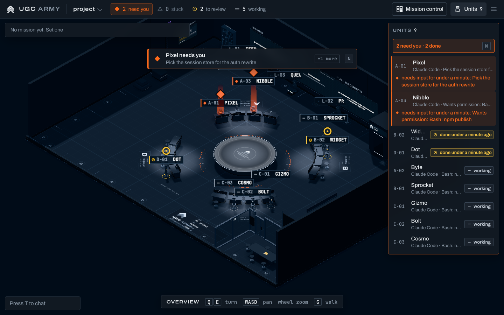

- The chrome is a fifth bigger, so the smallest type is about 15px, and unit callouts and glyphs are a quarter bigger.
- The needs-you toast stays up while anyone needs you.
- Once you're in, the Overview turns slowly round the mission table. Any key, drag or wheel takes over.
- Lit edges, screens and state lights bloom a little more than the Night glow (0.4 against 0.32, in Day too), so they survive video compression (`src/client/features/lights/`).

## Focus and keyboard

Every control can be reached by keyboard, and focus is always a 2px Signal ring with a 2px offset (inset on rows and tabs that fill their container). Every window has a close button top right with a 28px target; Esc or the close button puts you straight back into mouse-look in Walk, or back in the Overview if you opened it from there, with no extra click.

## Checking a change

- `npm run typecheck`, `npm test` and `npm run build` must all pass with clean output.
- `node design/shoot.mjs <folder> [shot,shot]` (after `npm run build`) starts the office on a spare port with a throwaway home, password and project, deploys a few stand-in units that report fake states, and saves screenshots under `design/shots/<folder>/`: the deck from fixed vantages, the Overview, the merge beat, demo mode, Mission control, the palette, settings, toasts, the 2D view at three widths and in print, and a terminal. It always stops the office afterwards. The before and after shots of each design stage are kept there.
- `node design/shoot-boards.mjs <folder>` does the same for the wall boards alone: each board of the situation wall from the conn, from halfway in, from the Overview and up close, and the capacity panel, with issues, pull requests, services and a queue filled in (`design/shots/boards-readability/` has the before and after).
- `SHOOT_LIGHT=night` or `SHOOT_LIGHT=day` before `node design/shoot.mjs` takes the shots under those bridge lights (the 3D deck, its HUD, the 2D view and the sign-in page alike), and `SHOOT_QUALITY=high` (or `low`, `medium`) at that Quality tier: software rendering picks Low by itself.
- `node design/perf-probe.mjs metal` times the deck on the GPU; `PROBE_SETTINGS='{"quality":"high"}'` holds it at High, since Auto can step down under the 4x CPU throttle, and `PROBE_CONN='[[0,2.98,11],[0,3.5,-6.5]]'` times it from the captain's seated eye on the dais (the default is the old conn's eye, for comparing with earlier rounds). Each conn line says the tier, its draw budget and `withinBudget`; the `motion` line is Ship motion on against off, three times each, by GPU timer where its answer is believable (ANGLE on Metal answers with wall time, tens of ms, and is not believed) and by the frame's CPU time otherwise (`features/quality/timing.ts`).
- `node design/soak-quality.mjs 10` runs Auto on the GPU for ten minutes with the first version's Low cap saved, terminal bursts, Night to Day and back and two jumps, and fails if Auto ever draws at Low or Settings doesn't say *Auto - running at High* at the end.
- `SHOOT_LIGHT=night SHOOT_QUALITY=high node design/shoot-interior.mjs interior-<stage>/after` takes the interior series' fixed shot on the GPU: the captain's view from the conn, a busy crew with desk-2 asking a question, the boards filled and the toasts (and the waiting card) closed. `SHOOT_POSE=sit` sits in the captain's chair as E does and shoots the chair's own framing rather than a pinned eye, `SHOOT_OVERVIEW=1` adds the Overview, `SHOOT_MASK=1` counts what covers the boards, `SHOOT_CAP=stale` saves the old Low cap first, `SHOOT_UI=1` adds the HUD menu and Settings > Bridge, `SHOOT_ROOT` shoots another checkout's build, `SHOOT_BACKEND=swiftshader` draws on the CPU as the e2e tests do, and `SHOOT_VANTAGES` adds named close-ups. `SHOOT_MOTION=hail,stuck,done,conn,jump,ambient,complete,iris,reduced` shoots the motion layer's beats after the main shot (`design/shoot-motion.mjs`): each beat started for real at `SHOOT_DESK` (default desk-12, in view from the chair), then held frame by frame on the beats' own clocks (`<name>-hail-<ms>.png`), the take of the conn with a key skipping it, the jump with the rail clicked through it, and a 5 s ambient clip (`<name>-ambient.mp4`). `SHOOT_LOUNGE=1` shoots the forward lounge (`design/shoot-lounge.mjs`): the ladder's foot and its hint, a moment up the rungs, the balcony, the view from a seat ahead, either side and up, a jump from it (with `SHOOT_CREW=calm`, since a jump never plays while a unit needs you) and a clip of the whole of it, recorded from the page's own frames. `node design/walk-check.mjs` walks the amphitheatre with the keys (down the aisle, up the risers and a gallery, against the dais's rail) and checks the chair's framing, G, I, Esc and N. `FLICKER_QUALITY=high node design/flicker-check.mjs metal` does the same for the black-frame check, so the glow is in it on a busy machine. `FLICKER_OVERVIEW=1` runs the black-frame check in the Overview with the wheel zooming all the way in and out, so the units' callouts change tier and pop in throughout, and `node design/shoot-callouts.mjs <out dir>` shoots the callouts' three tiers (the Overview at zoom 0.8, 1.6 and 3.0, the framed Overview, a unit up close on foot, and a frame part way through a zoom's staggered pop-in).
- `SHOOT_CLIP=space node design/shoot.mjs <folder> clip` records the space clip instead of the bridge one: along the port side past the giant, then up to the sun from the conn as a rib crosses it.
- Status colors are checked for contrast on `--void` and `--surface-1` (see the table in DESIGN.md), and on the instrument black they sit on in the 3D deck by night and by day (`tests/lights.test.ts`). Every state has a shape, so a grayscale or color-blind view still reads.
- `prefers-reduced-motion` in the browser's dev tools, or Settings > Bridge > Ship motion at Off, should leave nothing moving except a spinner.
