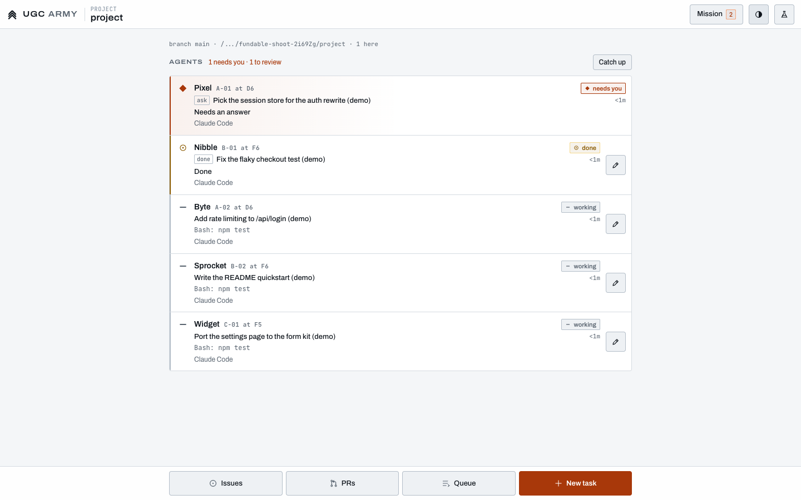

# The inbox

Back to the [README](../README.md).

The home page at `/` is the product: one inbox for every coding agent you run. It answers three questions in order: which agent needs you, what is ready to review, and what shipped today. Everything else the office can do is reachable from the avatar menu or Ctrl+K, and the parts beyond the inbox are [Labs](labs.md).

## The first visit

`npx mergeline` in the repository you work in opens this page in your browser, signed in (on your own computer there is no password; see [Security](security.md#signing-in-on-your-own-computer)), with that repository as the first project. Until the first agent, the list is the **setup card**:

- **Agents**: the agent CLIs on this computer, Claude Code, Codex and Cursor always and the beta ones when they're installed, each with whether it's signed in (read from its own files and keys, not by running it). One that isn't ready says the one line that fixes it (`claude auth login`, `npm install -g @openai/codex`...), with a copy button.
- **Project**: the folder Mergeline was started in. Started somewhere else, **Use <folder>** or a box to clone a repository from GitHub (admins).
- **GitHub**: optional. Without `gh`, review reads the local diff and Merge merges on this computer; **Check again** asks `gh` afresh.
- **Deploy your first agent** opens the Deploy sheet on a safe starter task (a 5-line SUMMARY.md on how to run the repository) with the first ready agent picked. Enter, and the agent is under Working within seconds.
- Under it, an unticked switch for [anonymous usage numbers](security.md#anonymous-usage-numbers), with exactly what it would send.

Already running Claude Code or Codex in a terminal? Quit it there and run `npx mergeline attach` in the same folder: its session carries on as one of the inbox's agents ([Configuration](configuration.md#command-line)). The server side of the card is `src/server/firstrun.ts` and `ws/handlers/setup.ts`; the card is `src/client/home/setup.ts`.

## The loop

1. **Deploy.** **Deploy agent** in the top bar (or **N**) opens one sheet: the project, the agent (Claude Code, Codex and Cursor up front; the others, marked beta, under More) and the task. The model and effort are under More. Enter starts the agent on a branch of its own, so agents on the same project never step on each other. The new agent is selected as it arrives.
2. **Get pinged.** The ranking in `src/shared/attention.ts` puts every agent in one of four sections. An agent with a question, or one that is stuck (crashed, silent, failing), is in **Needs you**. Finished work, a pull request to see to, or commits with no pull request yet is in **To review**. Agents at work are in **Working**, one line each with what they are doing now. Ready, asleep, merged and snoozed agents fold into **Idle**. With notifications on (the avatar menu), a browser notification comes up only when an agent starts needing you or has something to review, and clicking it selects that agent.
3. **Act.** Every row has one button: **Answer**, **Review changes**, **Fix checks**, **Merge**, **Send back** or **Resume** for the ones that need a person, and **Open** for one at work. Answer opens the agent's live terminal in the pane with the cursor in its reply box: type and press Enter. Review changes opens its diff. Fix checks asks the agent to look up its failing checks and fix them.
4. **Ship.** In the Changes tab, **Merge** merges the agent's pull request on GitHub when it has an open one, and otherwise merges its branch into the project's branch on this machine (see [Merging without GitHub](#merging-without-github)). The merge lands in **Shipped today** with the agent, the pull request or commit and how long the work waited on you, and the next agent that needs you is selected, so Enter keeps the loop going. **Send back** hands the work to the same agent with your note.

## The page

- **Top bar.** The product name, a project picker (All projects, or one; it shows once there are two), search (**/**), **Deploy agent**, a **Bridge view** link with that lab on, and the avatar menu.
- **The list**, on the left. Each row is the agent's mark (CC for Claude Code, Cx for Codex, Cu for Cursor), the task in plain words, why it is there, its project and branch, how long it has waited and its one button. Needs you and To review are always open: clicking their header never folds them. Idle opens with **Show**. Reminders that no listed agent stands for (a pull request approved an hour ago and still not merged, say) are rows of their own in Needs you.
- **The pane**, on the right: the selected agent. Its header has the task, the agent and model, how long it has worked, **Stop** (its session ends; its branch stays) and the row's button again. Three tabs: **Terminal** (live, with the keys a phone lacks and a reply box), **Changes** (the diff, the files, its pull request and checks, **Send back**, **Open PR** where there is a GitHub repository, and **Merge**) and **Log** (what happened to it, newest first). With nothing selected it says what waits and offers to start with the oldest.
- **Shipped today**, under the list: what merged since midnight, the count and the agent-hours behind it, and the merge rate by agent and model over the last 30 days.
- **Get started**, over the list from the first agent until done: Deploy an agent, Answer one question, Merge one change. Before the first agent, the setup card stands in for the list.
- **Avatar menu**: Work (Issues, Pull requests, Task queue), Mission control, notifications, light or dark, the keyboard shortcuts, Labs, Bridge view (with that lab on) and Sign out.

On a phone (under 900px wide) the list is the page, and tapping a row opens the agent over it with **Inbox** to go back. Answer and Merge are large tap targets.

## Keys

Six of them, never while you type in a box or a terminal, or while a window is open.

| Key | What it does |
| --- | --- |
| Ctrl+K (Cmd+K) | Find an agent by its task or name, or any command |
| N | Deploy an agent |
| Enter | The selected agent's next step (its row's button) |
| Esc | Back to the list: from the pane's terminal, out of the search box, or off the selection |
| / | Search agents |
| ? | These keys |

Up and Down (or j and k) move the selection. Esc in the pane's terminal comes back to the list rather than reaching the agent; the keypad's **Esc** button, or Ctrl+[, sends the agent one.

## The shipped log

Every review the inbox ends, merged or sent back, is written to `shipped.jsonl` in the office's data folder: which agent and model did the work, the prompt it was given, who reviewed it, what they decided, the branch and commit or pull request, and how long it had waited and worked. Each record is signed with an Ed25519 key the office makes for itself the first time (`shipped-key.pem`, next to the log, readable by its owner only), so a record can be checked later against the public key. Nothing is sent anywhere. The inbox reads the last 30 days for Shipped today and the merge rate.

## Merging without GitHub

With no open pull request, Merge works on this machine: what the agent left uncommitted is committed on its branch first, then its branch is merged into the project's branch in the project folder with a merge commit. It is refused, with the reason, when the project folder is not on that branch or has uncommitted changes of its own (a merge never mixes with work in progress), when the branch has nothing new, or when the branch conflicts; a conflict is aborted, so the folder stays clean. An agent that worked in the project folder itself (no git branch of its own) is merged by committing its changes there.

## For developers

The page is `src/client/index.html` with `lite.ts`, which connects and signs in, and `src/client/home/`, the inbox: `list.ts` (sections and rows), `pane.ts`, `deploy.ts`, `actions.ts` (what every button does), `keys.ts`, `palette.ts`, `menu.ts` and `shipped.ts`. The rules are pure and shared in `src/shared/inbox.ts` (sections, a row's action, Shipped today, the merge rate, the checklist; `tests/inbox.test.ts`). The server side is the `inbox` protocol domain, `src/server/ws/handlers/inbox.ts`, `src/server/shiplog.ts` and `src/server/localmerge.ts` (`tests/shiplog.test.ts`). `tests/inbox-e2e.test.ts` walks the loop in a browser with stand-in agents. The terminal, the Changes window and the other windows load when first opened (`home/lazy.ts`), and the terminal and Changes sit in the pane through `openModal`'s `dock`. See [Code layout](code-layout.md#the-inbox).
