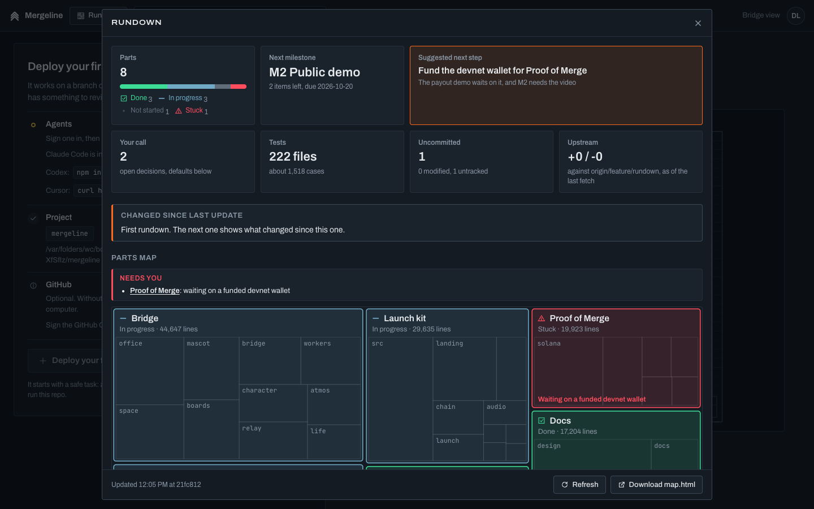
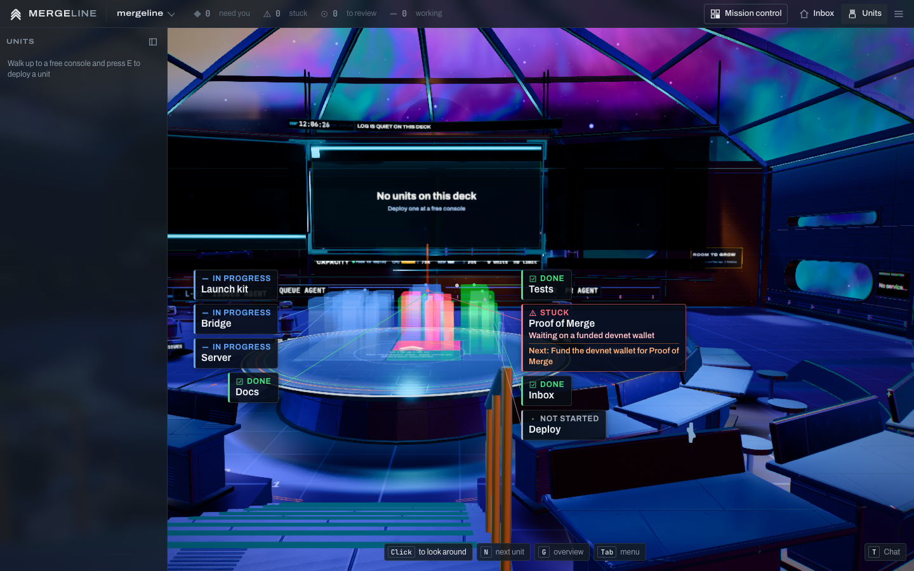

# Rundown

Back to the [README](../README.md).

Rundown is Kipdeck's map of one project: its main parts and how far each has got (done, in progress, not started, stuck), its milestones and what is left before the next one, the suggested next step, what changed since the last look, commit activity, branches and worktrees, and the decisions waiting on you, each with the default the map assumes until you answer.

It comes two ways, from one implementation:

- **The `/rundown` skill** in Claude Code, in any git checkout. It writes one self-contained page, `.rundown/rundown.html` (the same file as `map.html`), that opens offline with a double-click.
- **The office** (Labs > Rundown), for every project it hosts: the Rundown window in the inbox and on the Deck, and the project as a city of light over the Deck's holo table.



## The skill

```
/rundown           a full read: facts, Claude's judgement, the page (a minute or two)
/rundown quick     facts again, with the last judgement and your edits (a second)
/rundown facts     facts only, as a short summary
/rundown ~/code/x  another checkout
```

A full run collects the facts, Claude reads the repository and writes `.rundown/judgement.json` (the parts, their statuses and evidence, the next step, proposed milestones and new decisions), and the script renders the page. Its reply is short: where the page is, the next milestone with the items left, the next step, what changed, and the open decisions with their defaults. A vague question in the middle of other work ("where are we?") gets a short answer and an offer of `/rundown`, not a map.

The page shows every stuck part and what it waits on, in full, in a "Needs you" strip over the parts map, and draws the commit heatmap for as many weeks as the repository is old (8 to 26). It follows the saved style in `~/.claude/agent-memory/project-map/style.md` (`style: dark|light`, `accent: <name or #hex>`, shared with the project-map agent); `--theme` and `--accent` override it for one run.

The script refuses what it shouldn't map: a `--root` that isn't a folder stops it with exit 2 and is never created, and your home folder or `/` is mapped only when named with `--root`. Outside git it lists and opens nothing. In a repository with no commits yet it still reports the branch, the remote and the untracked files ("no commits yet on main"). Tools' caches nobody committed (`.playwright-mcp/`, `.turbo/`, `.cache/` and the like) are not counted as the project's code.

You edit two files, and the map never overwrites them:

- `.rundown/milestones.md`: ordered milestones, each with "Done when:" and a checklist. The first set is proposed by Claude and marked "Proposed: edit me". Later runs only tick items that are clearly done and add notes.
- `.rundown/decisions.md`: write your answer under `Answer:` and run `/rundown quick`. Answered ones show as resolved.

The rest of `.rundown/` is the script's: `facts.json`, `judgement.json`, `rundown.json` (the whole model), `state.json` (what the next run diffs against, written last, so a failed run never moves it) and `history/` (the last 20 states). `.rundown/` is kept out of git through the repository's common `.git/info/exclude`, never `.gitignore`. On the first run in a checkout that has the older `.project-map/`, its milestones, decisions and state carry over once.

### Where the script comes from

There is one implementation: the office's own code (`src/server/rundown/` and `src/shared/rundown/`), bundled by `vite.rundown.config.ts` into one dependency-free file for Node 18 or newer, `dist/rundown/rundown.mjs` (part of `npm run build`, or `npm run build:rundown` alone). The skill's own files are `skills/rundown/SKILL.md` and `skills/rundown/README.md`. There is no copy under this repository's `.claude/skills/`, so a project skill never shadows the global one.

`npm run rundown:install` builds the script and puts it, `SKILL.md` and `README.md` into `~/.claude/skills/rundown/`, which makes `/rundown` work in every directory. Before it changes anything it lists what is new, changed, unchanged and taken out (the scripts of an older install), copies the whole old folder to `~/.claude/backups/rundown-<time>/`, and prints a `diff -ru` command to compare. `npm run rundown:install -- --dry-run` only prints the list and `SKILL.md`'s diff. Screenshots in the installed `examples/` are left alone. Working on Mergeline itself, the skill uses the fresh build in `dist/` when there is one. Changing `SKILL.md` needs no build; changing the collector or the page means rebuilding (and installing again for the global copy).

## In the office

Switch on Labs > Rundown (or start with `--labs rundown`). Then:

- **In the inbox:** Rundown in the avatar menu and Ctrl+K opens the window for the picked project. It has a tab per project, Refresh, and Download map.html (the same page the skill writes).
- **On the Deck:** Rundown in the menu (Tab) and Ctrl+K opens the window for the deck you're on. **Rundown on the holo** raises the city over the mission table. While it's up the holo's star map, course column, waypoint plates and the heading's caption ("NO COURSE SET") all stand down, so nothing is written over the city. E at a district opens the window at that part. The window's ✕ or Esc puts you straight back into mouse-look.



The city: a district per part, laid out like the treemap and sized by its lines of code, up to six towers for its biggest folders, filling the table inside the milestone rings and standing on a plane a little over the tabletop so it clears the table's lip from the conn. Done parts glow green, parts in progress blue, parts not started are a faint grey wireframe, and a stuck part is red and blinks slowly. Only a stuck part is bright enough to bloom: every other colour is capped under the bloom's threshold, and the towers write depth, so looking along a row of them adds the nearest one or two rather than summing to a white blur. Each commit of the last 7 days sends a pulse up the towers of the parts it touched, and a district with uncommitted changes shimmers. The milestones are rings round the table's rim: solid when done, the active one orange with its done share lit, the ones ahead dashed. An orange beam rises from the next step's district. A short chime plays when a part changes status. With reduced motion or Ship motion Off the city holds still, and at Low quality there are no pulses.

Every district has a callout: its status as a glyph and a word, its name at 15 px, what a stuck part waits on, and on the next step's district the step itself. The callouts stand in two columns beside the city, each level with its district as far as the others allow and tied to it by a hairline, so none covers another or the city, from the conn, the pit or the side. They are part of the page over the 3D view, not the scene, so they read at any distance and cost no draw. They hide while a window is open and when you're more than 22 m from the table.

It draws nothing while it's down or the tab is hidden. Up, it costs at most four draws (towers, lines, rings, pulses) and puts away more than that: from the conn the perf probe measured 374 draws with the city up against 393 with it down at High (budget 400), and the shots 211 against 219 at Medium. `node design/shoot-rundown.mjs` fails if the city ever costs more than what stands down for it, or goes over the tier's budget; `node design/perf-probe.mjs` times the conn with the city up once it says it's built.

### What the office knows without Claude

The office computes a project's map itself, with the same collector, whenever someone has it open: the facts, and parts inferred from the folders with statuses worked out from activity (changes or commits in the last 14 days are in progress, under 50 lines not started, the rest done; never stuck, since only a person or Claude can say what something waits on). The window says so: "Statuses inferred. Run /rundown in this project for a real read." Once the skill has run in the project, the office takes the parts, statuses, evidence and next step from its `.rundown/rundown.json` (read only, 512 KB at most, checked) and your milestones and decisions from the two markdown files, with its own numbers. The office never writes into `.rundown/`; what it diffs against is its own `.agent-office/rundown/state.json`, moved on when the project's HEAD moves, or when its last look was 30 minutes or more ago, so "Changed since last update" also shows uncommitted work and status changes since you last looked.

It computes only while someone watches a project, one project at a time across the building, and looks again when HEAD or the working tree moved (checked every minute) or a pull request merged on that floor. Refresh is allowed once every 30 seconds per project. The download waits at most 45 s for a map and answers 503 rather than hang (a project taken off the building or the office closing while it waits also answer at once). A failed computation tells the page only "Couldn't read this project"; the detail, which may name server paths, goes to the office's log.

## The data model

One type, `Rundown` in `src/shared/rundown/schema.ts` (schema version 1), shared by the skill, the page, the window and the city:

| Field | What | Who fills it |
| --- | --- | --- |
| `project` | name, root, `owner/name` remote, default branch, HEAD, description | collector (Claude may sharpen the description) |
| `facts` | git (branches with ahead and behind, worktrees, recent commits, activity by day, contributors, uncommitted, upstream as of the last fetch), files (languages, folders, largest, manifests, tests, TODO locations, docs, CI), GitHub, gaps | collector |
| `parts` | id, name, summary, path globs, status, who decided it, what a stuck part waits on, evidence | Claude, or inferred from folders |
| `parts[].metrics` | lines, files, test files, TODO and FIXME, commits in 30 days, last commit, uncommitted | computed from the facts and the globs |
| `milestones`, `nextMilestone` | from `milestones.md`, or proposed | you, then Claude only ticks |
| `nextStep` | one action and why | Claude |
| `decisions` | question, options, default, raised date, your answer | Claude raises, you answer |
| `changes` | what changed since the last state, weighted | computed |

## Security and limits

Everything is read only, and nothing in the mapped project runs:

- Git runs through `execFile` with fixed arguments, never a shell, each call with a 10 s timeout and a 16 MB buffer, with `GIT_OPTIONAL_LOCKS=0` (status never writes the index), no pager, no prompt, and `core.fsmonitor`, the untracked cache and signature checks switched off; `log` adds `--no-ext-diff --no-textconv`. Nothing fetches, checks out or writes a ref. `gh` is used only by the skill, optionally, for 15 s at most; the office uses its own GitHub cache.
- Files come from `git ls-files` (tracked, and new ones not ignored), never a folder walk. `.git/`, `.agent-office/` (the workers' worktrees), `.rundown/`, `.project-map/`, `.claude/worktrees/`, `node_modules/`, nested repositories and symlinks are left out; lockfiles, minified and built files are listed but not counted in lines.
- Files that may hold secrets or personal data (`.env*`, keys and keystores, anything named for credentials, secrets or a vault, dumps, backups, logs) are counted and never opened. Binaries are skipped. TODOs are recorded as path, line and tag, never their text. Contributors are display names, never emails. Remote URLs lose any credentials.
- Caps: 50,000 files, 1 MB read per file and 200 MB per run, 20 s for the skill and 15 s for the office (partial results say so), 40 branches and worktrees, 30 recent commits, 182 days of activity.
- The office computes only for floors of its building, named by id; a page never sends a path. The download route needs a signed-in session and the lab. In the read-only demo there is no rundown at all: the download route isn't there, and watching is dropped without a word (contributors, uncommitted paths, TODO locations, branches and decisions are not for anonymous visitors).
- The page embeds only the model, never file contents, and makes no request of any kind (its own policy forbids them).

## For developers

- `src/shared/rundown/`: the model (`schema.ts`, `model.ts`, `infer.ts`, `diff.ts`, `markdown.ts`, `validate.ts`), the layouts (`treemap.ts`, `heatmap.ts`, `branches.ts`, `paths.ts`) and the page (`html.ts`, `html-sections.ts`, `html-assets.ts`). Pure.
- `src/server/rundown/`: the collector, the office's service, and the skill's CLI. `ws/handlers/rundown.ts` (watch, unwatch, refresh) and `http/routes/rundown.ts` (the download), gated by `ws/labgate.ts` and the route's `lab`.
- `src/client/ui/rundown/`: the window, loaded lazily by the inbox (`home/lazy.ts`) and the bridge. `state/slices/rundown.ts` keeps what the office sent per floor.
- `src/client/features/rundown/`: the holo city (`world.ts` the fixture, `city.ts` the meshes and shaders, `labels.ts` and `callouts.css` the callouts, `logic.ts` the pure layouts of the city and the callout columns, `sound.ts`), its menu rows and Ctrl+K entries, and E at a district. `Holo.yieldTo` in `features/bridge/holo.ts` and `HoloHeading.yieldTo` in `features/life/heading.ts` are the seams it uses there.
- Tests: `tests/rundown-*.test.ts` (the model, the diff, the markdown files, validation, layouts, the collector against a repository with traps in it, the handlers and route, and the built script and its page in a headless browser). Screenshots: `node design/shoot-rundown.mjs` after `npm run build`, into `design/shots/rundown/final/`; it also checks every callout is on screen, at 14 px or more, and clear of the others, from the conn, the pit and the side. `FLICKER_RUNDOWN=1 node design/flicker-check.mjs` sweeps the table with the city up.
